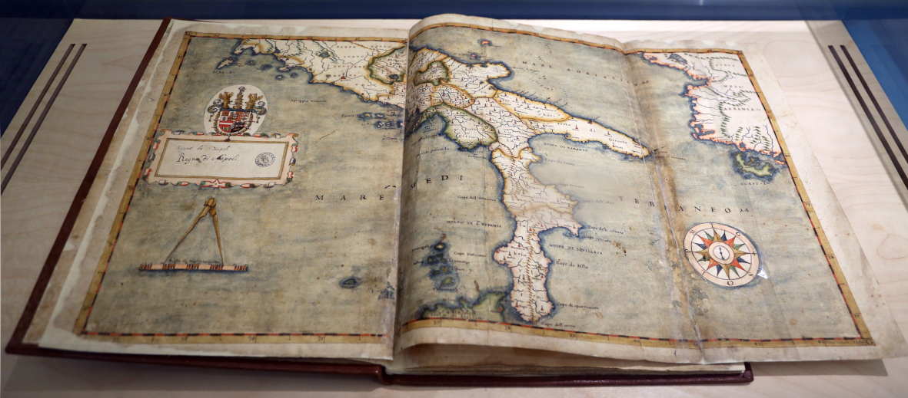

# Lab 1 - Visualizing Spatial Data

<figure><figcaption>
Map of the Kingdom of Naples by Mario Cartaro, 1613. Held at the Biblioteca Nazionale in Naples. <a href="https://commons.wikimedia.org/wiki/File:Mario_cartaro,_mappa_del_regno_di_napoli,_1613_(napoli,_bibl._nazionale).jpg">Image source: Wikimedia Commons</a>
</figcaption></figure>

## Introduction

Welcome to your first lab exercise! In this session, you'll dive into one of the most powerful ways we make sense of spatial information: visualization. Whether it's tracking climate change, planning urban spaces, or mapping biodiversity, clear and thoughtful maps help us understand patterns, tell compelling stories, and support decision-making. Today, you'll learn how to create your own maps using QGIS, a free and widely used tool in science and industry. This lab will introduce you to core mapping concepts and give you hands-on experience turning raw spatial data into meaningful visualizations. We'll start by creating an overview map of our chosen study area, which highlights the location and distribution of your study object and includes essential map elements such as a grid, legend, and scale. This lab will help you understand the basics of cartographic design, an essential first step in any spatial data science project.

## Learning Objectives

By the end of the lab, you are able to:

* Install and use basemap tools (QuickMapServices, XYZ Tiles) to add geographic context to your map.
* Select and apply an appropriate CRS to ensure accurate spatial representation of your data.
* Load, reproject, and style multiple spatial datasets (vector, raster, CSV) to create a visually balanced overview map.
* Compose and export a high-quality map layout including legends, insets, grids, and annotations.
* Evaluate your cartographic design choices and explain them in an extended caption referencing sources and projection rationale.

## Task

Imagine you've just joined a multidisciplinary research team preparing for fieldwork in a newly selected study region. In your role working on spatial data, you will prepare a high-quality overview map that introduces the study region, sets the geographic context, and communicates the project’s focus to collaborators, funders, and stakeholders who may not yet be familiar with the area.

This map will appear in the project proposal, early research reports, and likely your own future thesis. It’s the first visual anchor others will see, so clarity, accuracy, and design matter. As one of your teammates puts it with a grin:

> _“If your map doesn’t make sense, the rest of the proposal might as well be written in Klingon.”_

Your job is to make sure the map speaks clearly, and speaks first.

### Your Mission

You are tasked with producing a _high-quality overview map_ that introduces your chosen study area and visualizes a relevant environmental or geographic topic.

You are free to:

* _Choose your own study area_ anywhere on Earth. Maybe it’s a glacier in Alaska, a tropical forest reserve, or your own hometown.
* _Define a study object or theme_, you want to display on your map. such as glacier retreat, forest fragmentation, urban expansion, or nature conservation.

To complete your mission, your map must include:

* _A basemap_ (to provide geographic context and orientation for your study area).
* _Thematic vector layer(s)_ relevant to your topic (e.g. protected areas, forest cover, urban zones).
* _An annotated point layer_ (e.g. field stations, sampling sites, or major cities).
* _An inset map_ (to show your study area’s location in a broader regional or global context).


**Note**: Make sure you define your own study area and topic, rather than simply reproducing the workflow example below.


### Your Deliverable

As with all good scientific communication, your map report includes your figure _accompanied by a clear, well-structured caption._ In it, you’ll:

* [x] Explain the purpose of the map and what it visualizes.
* [x] Describe each data layer, including their sources and relevance.
* [x] Justify your choice of projection (CRS) and why it is a good fit?
* [x] Reflect on your styling decisions and challenges you encountered
* [x] Acknowledge and [cite](https://www.citethisforme.com/) sources of design inspiration, if applicable.

### Why this matters

This task mirrors what you'll do in future spatial data science projects. In many projects (e.g. MSc thesis) you need to work with open data, choose the right projection, and design maps that communicate clearly and effectively. These skills are directly transferable to later labs, your thesis, and professional projects.

You’ll also gain confidence in:

* Navigating QGIS,
* Managing coordinate reference systems,
* Combining and styling diverse spatial datasets,
* And producing professional, reproducible map outputs.

## Workflow

In this lab, we’ll work through a structured cartographic workflow from selecting a study area and adding basemaps to styling layers and designing a final map layout. Each step builds on the previous one, guiding us through data preparation, coordinate reference systems, visual design, and map composition.  You may find this [video of the Lab-1 workflow](https://youtu.be/L6HmO45Am7M) helpful, if you are unfamiliar with QGIS. \
Let's start with something fun: basemaps!&#x20;

### 1. Basemaps

Basemaps are background maps that provide geographic context for our data, such as satellite imagery, terrain, or street maps. They help us orient ourselves by showing familiar features such as roads, rivers, and elevation, and allow your own spatial data - points, lines, or polygons - to be seen in relation to the real world. In QGIS, basemaps are often added via the plugin `QuickMapServices` or as `XYZ tiles` and serve as a visual foundation for analysis and communication.

#### QuickMapServices

The QGIS QuickMapServices plugin provides easy access to a wide range of online basemaps, including OpenStreetMap, Google, and ESRI imagery. Here is how to install and use it.

<figure><figcaption>
Install the QuickMapServices Plugin
</figcaption></figure>

1. Install the _QuickMapServices_ Plugin
   1. Go to the `Plugins` menu.
   2. Click `Manage and Install Plugins`.
   3. Search for `QuickMapServices` and click Install.&#x20;
2. Add a Basemap
   1. After installing, go to the `Web` menu.
   2. Choose `QuickMapServices > Settings > More services` tab.
   3. Click `"Get contributed pack"` to unlock more basemaps (like Google, ESRI, OSM, etc.).
   4. Now go to `Web > QuickMapServices` and pick a basemap (e.g., OSM Standard, Google Satellite, or ESRI Topographic).


**Hint:** Another basemaps plugin you may want to explore is _HCMGIS_.


#### **XYZ Tile Layers**

The XYZ Tile Layers option in QGIS allows us to add web-based map tiles (like OpenStreetMap or satellite imagery) directly into our projects using simple URL templates. It's a built-in, flexible way to display basemaps without the need for plugins. We can easily add basemaps in the Browser panel (`View > Panals > Browser`) by right-clicking on  XYZ Tiles and adding a new connection. All we have to do is copy the URL of the web map server and give it an appropriate name. See below for details on both for various basemaps.

<figure><figcaption>
Add a basemap with a new XYZ Tile Connection
</figcaption></figure>

<em>High-resolution imagery</em>

* Google Maps
  * http://mt1.google.com/vt/lyrs=s\&x={x}\&y={y}\&z={z}
* ESRI World Imagery:&#x20;
  * https://services.arcgisonline.com/ArcGIS/rest/services/World\_Imagery/MapServer/tile/{z}/{y}/{x}
* Bing Aerial
  * http://ecn.t3.tiles.virtualearth.net/tiles/a{q}.jpeg?g=1

<em>Roadmaps</em>

* OpenStreetMap
  * https://tile.openstreetmap.org/{z}/{x}/{y}.png
* Google Streets:
  * http://mt1.google.com/vt/lyrs=m\&x={x}\&y={y}\&z={z}
* CartoDB Positron (Light)
  * https://a.basemaps.cartocdn.com/light\_all/{z}/{x}/{y}.png&#x20;
* CartoDB Dark Matter (Dark)
  * https://a.basemaps.cartocdn.com/dark\_all/{z}/{x}/{y}.png

<em>Topography</em>

* Mapzen Global Terrain
  * https://s3.amazonaws.com/elevation-tiles-prod/terrarium/{z}/{x}/{y}.png
* World Hillshade
  * http://services.arcgisonline.com/ArcGIS/rest/services/Elevation/World\_Hillshade/MapServer/tile/{z}/{y}/{x}
* ESRI Topographic
  * https://services.arcgisonline.com/ArcGIS/rest/services/World\_Topo\_Map/MapServer/tile/{z}/{y}/{x}
* Google Terrain
  * https://mt1.google.com/vt/lyrs=p\&x={x}\&y={y}\&z={z}

You can find many more maps [here](https://qms.nextgis.com/).

If we want to view a specific basemap in our map view we can double-click it to add it to the Layers panel (`View > Panels > Layers`) .

#### **WMS / WMTS Layers**

QGIS supports _WMS (Web Map Service)_ and _WMTS (Web Map Tile Service)_ layers, which let us stream high-quality, up-to-date geospatial data from public or institutional servers directly into our project. These services are useful for visualizing geo datasets, such as aerial imagery, land use, protected areas, or infrastructure, without downloading the data.

To add a WMS or WMTS layer in QGIS:

1. Open the Browser panel (`View > Panels > Browser`)
2. Right-click on WMS/WMTS and select "New Connection..."
3. Add the following connection details:
   * Name: geo.admin.ch (or any name you choose)
   * URL: `https://wms.geo.admin.ch/?VERSION=1.3.0&lang=en`

Once connected, you'll be able to browse and add WMS layers from various Swiss federal offices. These correspond mostly to what is shown on [map.geo.admin.ch](https://map.geo.admin.ch), but are available as interoperable WMS layers for use in your own GIS projects.\
[This service](https://www.geo.admin.ch/en/wms-available-services-an-data) is a reliable and official source of Swiss geodata and ideal for adding national context to your maps without storing large local files.

#### Visualization

If we add the `World Hillshade` and `Mapzen Global Terrain` [basemaps](lab-1-visualizing-spatial-data.md#basemaps) to the Layers panel, we can explore key features of the Layer Styling panel (_View > Panels > Layer Styling_). The layer selected in the _Layers_ panel is automatically active in the _Layer Styling_ panel, where we can adjust the visualization mode, apply value stretching, choose a color ramp, set transparency, and fine-tune many other display options to enhance our map’s appearance.

To explore some styling features, let’s take a look at the Layer Styling settings used in the map display below. Here, the _Mapzen Global Terrain_ layer is styled using the _Singleband pseudocolor_ mode. The _Min/Max values_ are set to _0 and 5000_ to match the main elevation range. For the color ramp, I selected _Create new color ramp > Type: "Catalog: cpt-city" > Name: Topography > Palette: DEM\_poster_ to give the elevation data a clear and visually appealing gradient. In the _Transparency_ tab (), setting the _Global Opacity_ to _80%_ allows the terrain variation of the underlying _hillshade_ layer to show through, creating a more informative and visually rich map. Alternatively, in the Layers panel, place the hillshade layer above the color-coded DEM. In the 'Symbology > Layer Rendering' panel, try applying different blending modes (e.g. 'Overlay', 'Multiply') to the hillshade image to combine both layers.

<figure><figcaption>
The hillshade terrain basemap blended into the color-coded elevation basemap using the 'Multiply' mode.
</figcaption></figure>

### 2. Plan your map

#### Map Purpose and Audience

Before creating any map, it's important to consider its _purpose and intended audience_. In this lab, we’ll design an overview map that introduces our study area and highlights key features. This type of map is often used as the first figure in a BSc or MSc thesis to help readers quickly understand _where_ the study takes place and _what_ it focuses on. Since our audience may include people unfamiliar with the region or with geospatial data, our map should communicate clearly and effectively - avoiding unnecessary detail while ensuring that essential elements (like locations, labels, and scale) are easy to read and well organized. Thoughtful design choices at this stage will make our map not only informative but also visually appealing and accessible to a broader scientific audience.

#### **Coordinate Reference Systems**&#x20;

Every map is based on a coordinate reference system (CRS), which defines how the Earth's curved surface is translated onto a flat map. There are two main types: _geographic coordinate systems_, which use latitude and longitude to describe locations on a globe (e.g. WGS84), and _projected coordinate systems_, which transform this information into a flat, 2D plane using units like meters. For spatial analysis and clear visualization, especially in regions with complex terrain like the Alps, a projected CRS is usually preferred because it preserves distances, areas, or shapes more accurately. Selecting the right CRS is essential to ensure our map is both accurate and meaningful.

<table data-full-width="false"><thead><tr><th width="119.20001220703125"></th><th width="334.0999755859375">Geographic coordinate system</th><th>Projected coordinate system</th></tr></thead><tbody><tr><td>Shape</td><td>Spherical, like a globe</td><td>Flat, like a map</td></tr><tr><td>Units</td><td>Angular (typically degrees of latitude/longitude)</td><td>Linear (typically in meters)</td></tr><tr><td>Purpose</td><td>Specifies precise locations on the Earth’s surface</td><td>Displays spatial data accurately on a flat map</td></tr><tr><td>Use Case</td><td>Data storage, GPS, global datasets</td><td>Mapping, measurement, spatial analysis</td></tr><tr><td>Examples</td><td>
<em>WGS 84</em> (EPSG:4326) – global GPS, default for many datasets 

(EPSG = European Petroleum Survey Group)
</td><td>
<em>Web Mercator</em> (EPSG:3857) – web maps (Google, OSM) 

<em>UTM Zones</em> (e.g. EPSG:32632, 32633) – regional mapping worldwide

<em>CH1903+ / LV95</em> (EPSG:2056) – Switzerland
</td></tr></tbody></table>


**Quick Task**: _Explore the Effects of Different Coordinate Reference Systems (CRS)_

* **Load a vector layer of global countries**\
  Download the dataset from [Natural Earth](https://www.naturalearthdata.com/downloads/10m-cultural-vectors/10m-admin-0-countries/).\
  Drag the file `ne_10m_admin_0_countries.shp` directly into the _Layers_ panel.
* **Change the project CRS**\
  Look for the EPSG code in the bottom-right corner of the QGIS window. Click on it to open the _Project CRS settings_.
* **Try different CRS and observe the effects**\
  Use the filter bar to search for and apply the following EPSG codes one by one:
  * _EPSG:3857_ – Web Mercator (used in web maps; distorts area)
  * _EPSG:4326_ – WGS 84 (lat/lon in degrees; no projection)
  * _EPSG:32632_ – UTM Zone 32N (local projection in meters)
  * _EPSG:3035_ – ETRS89 / LAEA Europe (equal-area for Europe)
* **Observe what changes**\
  Watch how the shapes, sizes, and relative positions of countries change depending on the CRS.\
  Ask yourself:
  * Are the shapes still accurate?
  * Is the area distorted?
  * Which CRS seems most suitable for mapping countries in Europe?


Below are two examples showing the OpenStreetMap basemap and global countries vector layer displayed with different projections. Compare the projections and observe how the shape, size, and positions of countries change depending on the chosen coordinate reference system.

<figure><figcaption>
EPSG:3857
</figcaption></figure> <figure><figcaption>
EPSG:3035
</figcaption></figure>

In this lab, we’ll use the _ETRS89 / LAEA Europe projection (EPSG:3035)_ as our project CRS, as it is well-suited for spatial analysis across Europe and preserves area and shape more accurately than most other projections (e.g. Web Mercator).

#### Layer Composition

A well-designed map relies on thoughtful layer composition to guide the viewer's attention and provide geographic context. In this lab, we use both _vector and raster data_ to build a meaningful visualization of our study area in the European Alps. The _lakes_, our main feature of interest, are polygons displayed in color to stand out clearly against the background. Ground _station locations_ (e.g. webcam validation sites) are shown as point features, also in color, to help link them visually to the analysis. The _area of interest_ is defined by the Alpine Convention Perimeter polygon and highlighted with a subtle transparent fill. To provide geographic orientation without overwhelming the viewer, we include _country boundaries_ and _open water bodies_ in neutral gray tones. A _hillshade raster layer_ is added as the base layer to show the rugged topography of the Alps and surrounding terrain, using light gray tones to enhance readability. This combination of layers—and the order in which they appear—helps balance focus, context, and aesthetics while respecting the different data types (vector for features and boundaries, raster for elevation). Understanding how to organize and style layers is a key part of effective cartographic design. But first, we collect the data we for the layers.

### 3. Data acquisition

There are often multiple ways to access the data we need for a map project. In this section, we link to sample datasets that are relevant to our current mapping task, along with some general pointers. For your own projects, you'll often need to explore options online and select data independently. Section "[Get your data](lab-3-creating-online-maps.md#get-your-data)" in Lab 3 also points you to several open data platforms for further guidance.

#### Basemap

The ESRI hillshade basemap is useful for visualizing topography. However, in QGIS version 3.28.15, it only displays correctly when the project is set to EPSG:3857 or EPSG:4326. This limitation affects "only" the main QGIS map view. Our final map layout will render the hillshade basemap correctly in any projection.

If you prefer to create your own hillshade, check out the "[The extra mile](lab-1-visualizing-spatial-data.md#optional-the-extra-mile)" section later on. Otherwise, we'll use the ESRI hillshade basemap and keep the project CRS in EPSG:3857 for visualization purposes, while the data itself and the final map layout will use EPSG:3035.


**Shortcut**: If you want to skip the upcoming download and reprojection steps for this project, you can download the reprojected mapping layers [here](https://drive.google.com/drive/folders/1eo3KjMsx7uIjv8UZBuS9zUpdhlB_MRg6?usp=sharing).


#### Geographic orientation data

Natural Earth offers a collection of open, public-domain datasets covering various global features. For this project, we will download the 1:10 million scale datasets for oceans and countries.

* oceans: [https://www.naturalearthdata.com/downloads/10m-physical-vectors/10m-land/](https://www.naturalearthdata.com/downloads/10m-physical-vectors/10m-land/)
* land: [https://www.naturalearthdata.com/downloads/10m-physical-vectors/10m-land/](https://www.naturalearthdata.com/downloads/10m-physical-vectors/10m-land/)
* countries: [https://www.naturalearthdata.com/downloads/10m-cultural-vectors/10m-admin-0-countries/](https://www.naturalearthdata.com/downloads/10m-cultural-vectors/10m-admin-0-countries/)

<figure><figcaption></figcaption></figure>

#### Area of interest

Our _Area Of Interest_ (AOI) is defined by the Alpine Convention Perimeter, which we can download [here](https://www.atlas.alpconv.org/layers/geonode_data:geonode:Alpine_Convention_Perimeter_2018_v2).

#### Land cover

Below is a selection of open-access datasets for various land cover types that you may find useful for your map project. In our example, we’ll use the _lakes dataset_, but feel free to explore others depending on your study focus.

* _Lakes_\
  [HydroLAKES](https://www.hydrosheds.org/products/hydrolakes#downloads) – A global database of lakes (≥10 hectares), including geometry and attributes. Provided by HydroSHEDS. (Download as shapefile)
* _Glaciers_\
  [Randolph Glacier Inventory (RGI) v7.0](https://nsidc.org/data/nsidc-0770/versions/7) – A globally complete inventory of glacier outlines, hosted by the National Snow and Ice Data Center (NSIDC).
* _Forests_\
  [Global Forest Watch](https://www.globalforestwatch.org/) – Forest Extent & Change overlays for intact forests, plantations, and deforestation alerts.
*   _Cities and Urban Areas_\
    [Global Human Settlement Layer (GHSL)](https://ghsl.jrc.ec.europa.eu/download.php) – Gridded data on built-up areas and population density, from the European Commission.

    [Natural Earth – Urban Areas](https://www.naturalearthdata.com/downloads/10m-cultural-vectors/10m-urban-area/) – Global generalized city polygons.\
    [Global Urban Footprint](https://www.dlr.de/de/eoc/forschung-transfer/projekte-und-missionen/global-urban-footprint) (DLR) – High-resolution vector layers of global urban footprint
*   _General Land Cover_\
    [ESA WorldCover 10 m Land Cover Map](https://esa-worldcover.org/en) – High-resolution global land cover classification, including forested areas. Free and downloadable by region.&#x20;

    [CORINE Land Cover (CLC) ](https://land.copernicus.eu/en/products/corine-land-cover)– land cover data for Europe, including detailed land cover types like agriculture, wetlands, and urban areas.

### 4. Data processing

Now that all datasets are downloaded, we need to prepare them by selecting only the relevant features and reprojecting all datasets to a common CRS. This ensures that all layers align correctly and can be combined into a coherent map

#### Reprojection

Spatial datasets often come in different coordinate reference systems (CRS), which can lead to misalignment when combining them in a map project. To ensure all layers align correctly, it’s important to _reproject all datasets to a common CRS_ (EPSG:3035 in this pan-European mapping project).

We can load our datasets into QGIS by simply dragging them into the _Layers panel,_ or by using the _Data Source Manager_ (accessible via the toolbar symbol  or `Layer > Add Layer > ...`).

To reproject our data:

* **For vector layers**:\
  `Right-click the layer > Export > Save Features As...`\
  In the dialog, set the CRS to EPSG:3035 before saving as a geopackage file.
* **For raster layers**:\
  Use the _Warp (Reproject)_ tool:\
  `Raster > Projections > Warp (Reproject)`\
  Choose EPSG:3035 as the target CRS and specify a file name for the output as a .tif file.

<figure><figcaption>
Select and reproject (export) the lakes in our area of interest 
</figcaption></figure>

#### Selecting a vector subset

The _HydroLAKES_ dataset covers lakes worldwide, but for this project, we only need lakes within the Alpine Convention area. To extract this subset:

1. Load both the _HydroLAKES_ and _Alpine Convention_ layers.
2. Go to `Vector > Research Tools > Select by Location`.
3. In the dialog:
   * Set HydroLAKES as the input layer (select features from).
   * Set Alpine Convention as the comparison layer.
   * Keep _“intersect”_ as the spatial relationship.
4. Open _Advanced Parameters_ () and set Invalid feature filtering to "Do not filter".
5. Click _Run_ to select all intersecting lakes.

Then, right-click the HydroLAKES layer and choose `Export > Save Selected Features As...` to create a new layer containing only the Alpine lakes in the EPSG:3035 projection.

#### Adding spatial data from a CSV file

For our project, we also use webcam data for validation purposes. We can easily add the webcam locations to our map using a simple CSV file by following these steps.

1. Prepare our CSV file
   * Make sure your file includes _latitude and longitude columns_ (in this case, `Lat` and `Lon`)&#x20;
   * Make sure it is saved with the `.csv` extension.
   * We can download the sample CSV file for this project [here](https://drive.google.com/file/d/1pSOBt0crHNtDhADyItUXY6ve6lEq3TGN/view?usp=sharing).
2. Load the CSV into QGIS
   * Go to `Layer > Add Layer > Add Delimited Text Layer…`
   * Click "…" next to _File name_ and select your CSV file.
   * Under Geometry Definition:
     * Choose Point coordinates.
     * Set X field to `Lon` and Y field to `Lat`.
   * Make sure Geometry CRS is set to EPSG:4326 – WGS 84 (this matches standard latitude/longitude).
   * Click Add and then Close.
3. Right-click the layer to export it in the EPSG:3035 project projection

#### Layer styling

Now that we have downloaded and projected all the data, we should arrange and style it to create a clear, readable, and visually appealing map. A well-designed map draws attention to key features, supports interpretation, and avoids visual clutter. By using the Layer Styling panel, we can control how each layer is displayed and establish a strong visual hierarchy, ensuring that important elements stand out while background layers remain subtle.&#x20;

We can activate the Layer Styling panel in the Layers panel () or via `View > Layers > Layer Styling Panel` .


**Hint:** Save your QGIS project regularly (File > Save or Ctrl+S)! This helps you avoid losing your work in case the program crashes.


For the **Countries layer**, we’ll use only the _outlines_ as solid borders to provide geographic orientation, while setting the fill color to _transparent_ to avoid covering underlying map details (see below).

<figure><figcaption>
Transparent fill of the Countries layer
</figcaption></figure>

For the **Ocean layer**, we set the _fill color_ to a light grey (#cbcbcb) to create a subtle contrast with the landmass, helping to visually separate land and sea without overpowering other map elements.

<figure><figcaption>
Bright grey fill color in hex-code notation of the Ocean layer
</figcaption></figure>

For the **Alpine Convention Perimeter**, we use a _semi-transparent (15%) orange fill_ and set the _stroke color to fully transparent_. This subtly highlights our study area without distracting from the country borders or other map elements.

<figure><figcaption>
Semi-transparent orange fill.
</figcaption></figure>

The **lakes** are the main focus of our map, so we’ll style them with a bright blue fill to reflect the common association of blue with water. To make the smaller lakes stand out clearly, we’ll increase the stroke width to 0.75 mm and use a darker blue stroke color to ensure strong contrast against the background.

<figure><figcaption>
Coloring and stroke width of the lakes
</figcaption></figure>

For the **webcam locations**, we customize the _marker size, color, and symbol_ to make them easily distinguishable on the map. In the _Labels_ menu, we can annotate each point with an attribute such as the `location_id`, and further refine the appearance by adjusting the _text size, color_, and adding a _text buffer_ to improve contrast and readability against the background.

<figure><figcaption>
Symbology menu of webcam Layer Styling
</figcaption></figure>

<figure><figcaption>
Labels menu of the webcam Layer Styling
</figcaption></figure>


**Challenge**: QGIS offers a wide range of advanced cartographic tools. One of the most powerful is _Live Layer Effects_. This feature lets you enhance your map's appearance with effects like Drop Shadow, Outer Glow, and more, helping key features stand out visually. To explore this, expand the Layer Rendering section in the Layer Styling panel and enable _Draw Effects_. Try adding _drop shadows_ to your webcam location markers and their labels to give them depth and make them pop against the background.


### 5. Create your map

QGIS includes a powerful set of tools for creating map layouts, allowing us to design high-quality maps complete with elements such as insets, legends and scale bars. It also supports exporting our layout as an vector file or image for presentations or reports. In this section, we’ll take the map we created in the QGIS map canvas and turn it into a print layout.

#### Compose your map

1. Create a New Layout
   * Go to `Project > New Print Layout…`
   * In the dialog that appears, enter a layout name and click OK.
2. Set Page Properties
   * A new window titled Layout 1 will open.
   * Right-click on the canvas and select Page Properties…
   * Set the Size to A4 and Orientation to Landscape.
3. Add the Map
   * Go to `Add Item > Add Map`, then click and drag a rectangle across the canvas where the map should appear.
   * Use the full width of the page, leaving space at the margins for other elements.
4. Adjust Map Scale and Extent
   * Once the map appears, set the scale (e.g. 3'300'000) in the right-hand panel (`Item Properties > Main Properties`).
   * We can fine-tune the view using the "Move Item content" tool () to reposition the map.
5. Add a Legend
   * Go to `Add Item > Add Legend`, then draw a rectangle in an empty area of the map layout, ideally near the bottom or side.
   * The legend will automatically list all visible layers and can be styled in the Item Properties panel.
6. Add a Scale Bar
   * Go to `Add Item > Add Scale Bar`, then draw a rectangle in an empty area of the map layout, ideally near the bottom or side.
   * The scale bar will automatically show segments and a unit, which can be styled in the Item Properties panel.
7. Add a Title
   * Go to `Add Item > Add Dynamic Text > Project Title`, then draw a rectangle in an empty area on top of the map layout, ideally centered.
   * In the Item Properties panel you can write and style the title.
   * Titles should be concise but descriptive.
8. Add a Inset Map
   * Go to `Add Item > Add Map`, then draw a rectangle in an empty corner of your layout to place the inset map. This inset map provides spatial context for unfamiliar viewers.
   * In the _Item Properties_ panel, set the desired Scale and CRS to show the appropriate overview view in the inset.
   * To manage which layers appear in the inset:
     * Enable **"**_Follow map theme_**"** to apply a predefined layer theme from the main map in QGIS.
     * Once you’re happy with the settings, check **"**_Lock layers_**"** to freeze the inset map’s appearance.
   * Use the _Frame_ option to visually separate the inset map from the main map.
   *   Go to `Add Item > Add Shape > Add rectangle`, then draw a rectangle on the inset map to represent the extent of the main map.&#x20;

       * To style the rectangle, go to Item `Properties > Main Properties > Style` and adjust the Symbol Setting (transparent fill and red stroke color).

       <figure><figcaption></figcaption></figure>
   * Once we're satisfied with our layout, we can lock the map components in the Items panel to prevent accidental changes.
9.  Add a Grid

    * In the _Item Properties_ panel, expand the _Grids_ section and click the  button to add a new grid. Then click “_Modify Grid_”.
    * Set the grid type to _Markers_, and choose Cross as the _marker style_ for a clean coordinate reference.
    * To display decimal degrees, set the _CRS_ of the grid to _EPSG:4326 – WGS 84_.
    * Adjust the intervals so that you have approximately 2–3 ticks on each axis for a clear and readable layout.

    <figure><figcaption></figcaption></figure>

    * To label coordinates, go to `Draw Coordinates > Format > Decimal with Suffix`.
      * Display coordinates on the left and bottom axes.
      * Set Coordinate Precision to 0 for simplified label

<figure><figcaption></figcaption></figure>

#### Export your map

When your layout is complete, go to the _Layout_ menu and choose Export as Image.., Export as PDF..., or Export as SVG..., depending on your needs.

* _Image_ (PNG, JPG): Ideal for quick sharing or use in presentations.
* _PDF_: Best for print or high-quality digital documents.
* _SVG_: Suitable for further editing in vector design software like Affinity Publisher or Adobe Illustrator.

<figure><figcaption>
Study area of Michael Brechbühler’s MSc thesis on lake ice monitoring. Map design inspired by his original work.
</figcaption></figure>

### Optional: The extra mile

Completing this optional section can earn you up to 1 bonus point. We can also generate our own hillshade image based on a Digital Elevation Model (DEM). For our project we use the freely available [90 m Copernicus DEM,](https://portal.opentopography.org/raster?opentopoID=OTSDEM.032021.4326.1) which provides sufficient detail for our map.

<figure><figcaption></figcaption></figure>

To download the elevation data, define your area of interest using the following lat/lon coordinates: Xmin = 4, Ymin = 43, Xmax = 49, Ymax = 18 (in WGS 84 / EPSG:4326). You will need to provide your email address to receive the download link, which will be sent to you after approximately one minute.

Based on the _DEM_, we’ll create a **hillshade image** to serve as a bright, textured basemap that enhances topographic orientation. In the _Symbology_ tab of the _Layer Styling_ panel, set the rendering type to _Hillshade_, adjust the _Altitude_ angle to 20°, enable _Multidirectional_ shading for more natural terrain lighting, and increase the _Gamma_ value to 1.50 to brighten shadowed areas and improve contrast (see figure below).

<figure><figcaption>
Layer styling of the DEM
</figcaption></figure>

We can compare our own hillshade image with the ESRI World Hillshade to decide which one works better for our map.

Make sure both the World Hillshade basemap and our COP90m hillshade are visible in the _Layers_ panel. To view them side by side, go to `View > New Map View` to open a second map view. Dock this new view next to your main map by dragging it to one of the sides until a blue highlight appears.

In the new map view, click the _View Settings_ icon ( ) to synchronize the extent and scale with the main view.

To simplify the comparison, we create a map theme:\
In the _Layers_ panel, go to `Manage Map Themes (``) > Add Theme`, and name it _hillshade_.\
Then, in our new map view, we select this theme under _Set View Theme_ ().

To switch between hillshades in the main map view, we simply toggle the visibility of the top hillshade layer in the _Layers_ panel. This step lets us easily observe the differences between the two.

<figure><figcaption>
Comparison of the ERSI hillshade image (top) and the COP90m hillshade image (bottom).
</figcaption></figure>

## Resources

**QGIS and Cartography**

* [QGIS Documentation](https://docs.qgis.org/) – Official user guide and training materials for QGIS.
* [QGIS Tutorials and Tips](https://www.qgistutorials.com/en/) – Hands-on tutorials for beginners and advanced users.
* [Map Library](https://www.maplibrary.org/943/best-cartographic-design-resources-for-enhanced-map-aesthetics/) – Best practices for map design
* [Map Making](https://medium.com/nightingale/so-you-want-to-make-a-map-58c7f55f6b20)[ Blog](https://medium.com/nightingale/so-you-want-to-make-a-map-58c7f55f6b20) - So You Want To Make A Map?
* [somethingaboutmaps](https://somethingaboutmaps.wordpress.com/2026/08/03/a-few-minor-niceties/) - A Few Minor Niceties
* [Prix Carto](https://www.prixcarto.ch/) - SGK Swiss Society for Cartography
* [Easter Eggs](https://youtu.be/pH9Am3FgRS0?feature=shared) - QGIS Easter Eggs Explained

**Open Spatial Data Sources**

* [Natural Earth](https://www.naturalearthdata.com/) – Global physical and cultural vector data (e.g. country borders, land, oceans, etc.).
* [Copernicus Land Monitoring Service](https://land.copernicus.eu/en) – European land cover, forest, and high-resolution layers.
* [HydroSHEDS / HydroLAKES](https://www.hydrosheds.org/) – High-quality hydrographic data including global lakes and rivers.
* [ESA WorldCover](https://esa-worldcover.org/) – 10 m resolution global land cover map.
* [CORINE Land Cover](https://land.copernicus.eu/en/products/corine-land-cover) – Detailed European land cover data.
* [Global Nature Watch](https://globalnaturewatch.org/) – Forest cover and loss maps, monitoring tools.
* [Global Human Settlement Layer (GHSL)](https://ghsl.jrc.ec.europa.eu/) – Urban and population density data.
* [OpenStreetMap](https://www.openstreetmap.org/) – Community-driven base map data for roads, buildings, and more.

**Basemaps and Elevation**

* [ESRI Basemap Services](https://www.arcgis.com/home/gallery.html?sortField=relevance\&sortOrder=desc\&searchTerm=basemaps\&focus=layers-weblayers-tiles-wmts) – Gallery of ready-to-use basemaps.
* [Terrain Tiles](https://registry.opendata.aws/terrain-tiles/) – Registry of Open Data on AWS
* [USGS Earth Explorer](https://earthexplorer.usgs.gov/) – DEMs and satellite imagery (e.g., SRTM, Landsat).

**Coordinate Systems**

* [Map Projection Playground](https://projectionplayground.org/) – Interactive tool to explore how projections distort space.
* [EPSG.io](https://epsg.io/) – Lookup tool for coordinate reference systems and transformation codes.
* [Proj.org](https://proj.org/) – Details on projection systems and coordinate transformations used in GIS software.

**Citation and Inspiration**

* [Cite this for me](https://www.citethisforme.com/) – Tool to help cite data sources and online maps.
* [Map Gallery](https://mapgallery.esri.com/) by Esri – Examples of beautiful and effective maps for inspiration.

## References

Gandhi, U. (2025) _Introduction to QGIS_, _Spatial Thoughts_. Available at: [https://spatialthoughts.com/courses/introduction-to-qgis/](https://spatialthoughts.com/courses/introduction-to-qgis/) (Accessed: 12 April 2025).

Brechbühler, M. (2022) _Licmonitoring.com_, _licmonitoring.com_. Available at: https://www.licmonitoring.com/ (Accessed: 12 April 2025).
