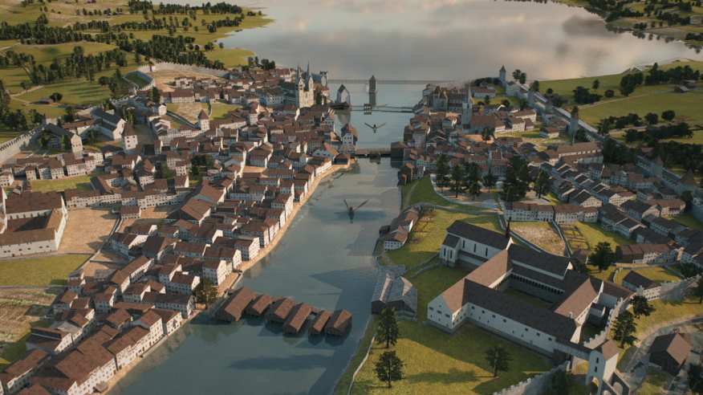

# Lab 2 - Exploring Temporal Changes

<figure><figcaption><p>Zurich around 1500, view to the south along the Limmat on the lake. Image generated by Micha Franz as part of the <a href="https://www.stadt-zuerich.ch/de/stadtleben/stadtportraet/zuerichs-geschichte/archaeologie/stadt/3d-stadtmodelle.html">Historical 3D City Models</a> project.</p></figcaption></figure>

## Introduction

Time is a powerful dimension in spatial data science. While maps traditionally capture a snapshot of space, adding the temporal domain reveals how patterns emerge, shift, and evolve. From the slow creep of urban sprawl to the sudden impact of a natural disaster, temporal data allows us to trace change, understand causality, and anticipate future developments. In spatial data science, temporal information can turn static maps into dynamic narratives.&#x20;

In this lab, you’ll step into the role of a spatial detective, uncovering how landscapes have transformed over time. By georeferencing historic maps and comparing them with present-day data, you’ll gain hands-on experience in aligning and analyzing spatial datasets from different time periods. This lab not only sharpens your technical skills but also deepens your understanding of the dynamic nature of our environment, by revealing how urban expansion, land use, or natural processes reshape space across decades. Let’s dive in and bring the past into conversation with the present!

## Learning Objectives

By the end of the lab, you are able to:

* Identify and retrieve suitable historical and contemporary spatial datasets from online archives and open data portals.
* Georeference a scanned historical map using Ground Control Points (GCPs) and appropriate transformation settings.&#x20;
* Digitize features (e.g. water bodies) from a georeferenced map to create a new vector dataset.&#x20;
* Calculate and interpret differences in area between historic and current features to quantify temporal change.
* Reflect on the reliability and limitations of different datasets and methods used in the temporal comparison.

## Task

Welcome to the Spatial Change Bureau, a fictional team of geographers, historians, and data scientists who are called upon when questions about our changing landscapes arise. You’ve just joined the bureau as a junior spatial detective on your first mission.

### Your Mission

A curious citizen, a policymaker, or a local historian has contacted your team with a question:

> _"How has this place changed over time, and what does that tell us about environmental or human impacts?"_

You’ve been assigned a case. Maybe it's the dramatic retreat of a glacier you once hiked, the steady sprawl of your hometown, the rerouting of a river, or the disappearance of forest cover in an area close to your heart or studies.

Your mission (_"should you choose to accept it"_) is to use your skills to _investigate and document spatial change_ in that area, based on evidence from both the past and the present.

### Your Toolkit

* **Historical data**: Old maps, aerial photos, or datasets from archives (e.g., [_e-rara.ch_](https://www.e-rara.ch/), historical map portals).
* **Modern data**: OpenStreetMap, satellite imagery, or government geodata portals.
* **Tools**: Georeferencing techniques, spatial overlay, and simple spatial analysis workflows you've practiced in previous labs.

### Your Steps

1. **Choose Your Case**\
   What question would you like to solve? (e.g. _How much ice has glacier X lost since 1850?_)
2. **Define Your Area of Investigation**\
   Pinpoint your spatial crime scene: the exact region you'll analyze.
3. **Collect the Evidence**\
   Retrieve old and new spatial data to compare.
4. **Analyze the Changes**\
   Use the georeferencing and analysis skills you've learned to visualize and measure changes.
5. **Report Your Findings**\
   Write a short case report summarizing what changed, by how much, and why it might matter.

### Your Deliverable

As a Spatial Detective, your case report must include:

* [x] **Case overview**: What case did you take on, and why?
* [x] **Visual evidence**: Side-by-side or overlay screenshots.
* [x] **Quantitative results**: What changed, and how much?
* [x] **Reflections**: Any dead ends? Clever workarounds? Insights?

## Workflow

In this workflow, we will examine how Zurich’s landscape has evolved over time by comparing [historical](https://youtu.be/ag1_i7SvkZU?feature=shared) and contemporary spatial data. First, we will georeference a scanned historic map, then digitise key features (here, water bodies) from the past. Next, we will gather official vector datasets representing the current situation, which we will then use to compare and quantify changes in Zurich’s geography over time.

### 1. Georeferencing

**Georeferencing** is the process of assigning real-world coordinates to each pixel in a raster image. It’s a crucial step in preparing spatial data for analysis, especially when working with historical or non-digital sources. Many spatial data science and machine learning projects rely on continuous records that span across decades, but older datasets often exist only as scanned maps or aerial photographs. In some cases, data is shared only as static images or PDFs, which must first be georeferenced to become usable in GIS workflows.

In this lab, we use **historical maps** from [**e-rara.ch**](https://www.e-rara.ch), a digital portal that provides access to digitised printed works from Swiss libraries. The platform hosts a wide range of materials, from early printed books to detailed maps and illustrations, spanning from the 15th to the 20th century.&#x20;


**Playtime**: Take some time to browse the catalogue by searching for keywords of interest and trying out the filtering options:



Digital portal of Swiss libraries.



**Tip**: If your search returns too many results, use filters (e.g. map, time period) to narrow it down. If you can't find what you're looking for, be aware that some filters may be too restrictive. Many records lack complete tagging. Try reducing or removing filters to broaden your search.


Here, we will georeference a historic scanned map of Zurich, originally drawn in 1867. To find the map, search for _"Zürich"_ on [e-rara.ch](https://www.e-rara.ch), filter b

&#x20;_Document Type: Map_ and _Period: 1861–1870_, or use this [direct link](https://www.e-rara.ch/zut/content/titleinfo/7193204) to access the map.


**Task**: Download the map to your working directory by clicking on it and selecting _“Download image”_.


Since the map lacks coordinate references, we will use a suitable basemap to locate matching features and define accurate **Ground Control Points (GCPs)**, transforming the historic image into a spatially aligned, GIS-ready dataset. GCPs are clearly identifiable features in the image or map whose coordinates are known or can be extracted from reliable geospatial sources. In our case, these coordinates are identified from already georeferenced layers (e.g. basemaps) within QGIS.

#### Georeferencing Workflow in QGIS

Georeferencing in QGIS is a simple and straightforward process. In this section, we’ll learn how to load a scanned map, collect Ground Control Points (GCPs), and transform the image into a georeferenced GeoTIFF ready for spatial analysis.

1. **Set Up Your Project in QGIS**
   * Open QGIS.
   * In the Browser Panel, right-click on XYZ Tiles → OpenStreetMap and choose Add Layer to Project. This will add the OSM basemap to your canvas.
   * At the bottom-right of the QGIS window, click on the CRS indicator (e.g., “EPSG:4326” or similar).
   * In the CRS selection window, search for EPSG:2056 (CH1903+ / LV95) and click OK to set the Swiss national coordinate reference system as the project CRS.
2. **Open the Georeferencer Tool**
   * Go to `Layer > Georeferencer` from the menu-bar to open the georeferencing tool.
   *   This will open a new [Georeferencer ](https://docs.qgis.org/testing/en/docs/user_manual/managing_data_source/georeferencer.html#georeferencer)window, which has two main parts

       * The top section displays your scanned image.
       * The bottom section is a table where Ground Control Points (GCPs) will appear.

       <figure><figcaption></figcaption></figure>
3. **Load the Scanned Map**
   * Click the Open Raster button () in the toolbar (ribbon) and select the downloaded image 7193206-original.jpg from your working directory. The image will load in the top section of the Georeferencer window.
4. **Familiarize Yourself with the Toolbar**
   * The ribbon contains important tools such as:
     * Zoom/Pan for navigation ()
     * Add/Edit Points for collecting GCPs ()
   * Take a moment to explore these tools. They’ll be essential for the next steps.
5. **Optional: Dock the Georeferencer Window**
   *   For easier workflow, we can dock the Georeferencer into the main QGIS window.

       * Mac: Go to QGIS → Preferences → Configure Georeferencer
       * Windows: Go to Georeferencer → Settings → Configure Georeferencer
       * Then check “Show Georeferencer window docked”.

        _Tip:_ Drag the window’s title bar to the bottom of the QGIS map window to dock it.
6.  **Add Ground Control Points (GCPs)**

    *   Now, find a feature visible in both the scanned map and the basemap (e.g., a road intersection or landmark).

        * Click Add Point () in the toolbar.
          * Click on the chosen feature in the scanned map.
          * In the pop-up dialog, click `From Map Canvas`.
          * Then, click the same feature on the QGIS main map canvas (the OSM basemap).
          * Confirm by clicking OK.

         _Tip:_ Press the space bar to toggle between moving the image and placing points.


    <figure><figcaption></figcaption></figure>

    * Repeat this process for more features.&#x20;
      * Select GCPs that are well-distributed across the entire map — avoid clustering points in one area, as this can reduce transformation accuracy.
      * Use a mix of different feature types (e.g., building corners, bridges, intersections, landmarks) for better spatial coverage.
      * Save your GCP points as a .points file so you can reload them later without repeating the georeferencing process.
    * For this lab, we will use a `Thin Plate Spline` transformation, which requires at least 10 GCPs well distributed across the historical map. More points may improve accuracy.
    *   _Optional:_ To help identify suitable GCPs, we can use Zurich’s open building age dataset and filter for buildings constructed in or before 1867.

        * Download the [buildings GeoPackage](https://data.stadt-zuerich.ch/dataset/ktzh_gebaeudealter__ogd_) to your working directory and add it to QGIS.
        * Open the _attribute table_ and locate the `GBAUJ` field (building year).
        * Use `Select by Expression` () to select features where `GBAUJ <= 1867`

        <figure><figcaption><p>Different options "<em>Select by Expression"</em> and "<em>Select using Form"</em> to filter features.</p></figcaption></figure>

        * Right-click the layer and choose `Export → Save Selected Features As...` to create a new GeoPackage of historic buildings.
7. **Set Up the Transformation**
   * Click the Transformation Settings button () and configure the following:
     * Transformation Type: Thin Plate Spline
     * Target SRS: EPSG:2056
     * Resampling Method: Nearest Neighbour
     * Output Raster: Name it `Zurich_1867_TPS.tif` &#x20;
     * Compression: LZW
     * Check: _Save GCP points_
     * Check: _Load in QGIS when done_
   * Click OK to apply settings.
8. **Start the Georeferencing**
   * Once satisfied, click Start Georeferencing ().
   * The output raster `Zurich_1867_georef_TPS.tif` will now appear overlaid on the basemap in your main QGIS window.


**Challenge**: Repeat the georeferencing process using _Polynomial 2_ instead of _Thin Plate Spline_ , and save the result as a new file (e.g., `Zurich_1867_georef_P2.tif`). Then compare the two outputs by overlaying them in QGIS. Use visual inspection to evaluate differences in accuracy and distortion. Briefly reflect on which method produces a better fit for this map and when you might prefer one transformation over the other.



**Hint:** In theory the plugin "[Bunting Labs AI Vectorizer](https://plugins.qgis.org/plugins/buntinglabs-qgis-plugin/#plugin-details)" should enable you to automatically place GCPs. [Bunting Labs](https://buntinglabs.com/solutions/ai-georeferencer) offers a free plan (1 full georeferencing per month). You would have to sign in first, before the plugin is enabled. Unfortunately, it does not work on my end (georeferencing button is not visible) but I very much like the idea behind it. See the [video here](https://www.youtube.com/watch?v=_UZuwIWkeeE\&t=1s).


### 2. Spatial analysis

Now that we’ve successfully integrated the historic 1867 map of Zurich into our GIS environment, we can begin to visually explore how the landscape around Zurich has changed over time. By overlaying the georeferenced map with a modern basemap (such as OpenStreetMap), we can identify spatial differences between past and present.&#x20;

In this section, our analysis will focus specifically on _water bodies_, including lakes, rivers, and canals. The goal is to digitally trace the historic water extent from the scanned map and later compare it to current vector data to assess where water bodies have remained or disappeared.

Besides manual digitizing, another approach to extract features from the historic map is supervised image classification followed by vectorization. In this method, you train a classifier to identify patterns (e.g. water, buildings, green areas) based on pixel values and convert the classified image into vector features.

| **Pros**                                   | **Cons**                                           |
| ------------------------------------------ | -------------------------------------------------- |
| Faster for large areas                     | Requires training samples and classification setup |
| Consistent application of class rules      | Less accurate for hand-drawn or faded maps         |
| Good for maps with clear color differences | May misclassify mixed or noisy areas               |

If you're interested in exploring this method, check out the optional task in the "[Extra Mile](lab-2-exploring-temporal-changes.md#optional-the-extra-mile)” section, where we introduce supervised classification using the Semi-Automatic Classification Plugin (SCP).

***

#### Digitizing Historic Waterways

To compare water datasets over time, we first have trace lakes, rivers, and canals visible in the 1867 map of Zurich. Here is how we do it:

1.  **Create a New Vector Layer**

    * Go to `Layer → Create Layer → New GeoPackage Layer…`
    * Click the `...` button next to Database, navigate to your project directory, and name the file `Zurich_1876_water`.
    * The Table name will auto-fill as `Zurich_1876_water`.
    * Set the Geometry type to MultiPolygon (to capture area features like lake surfaces and river widths).
    * Set the CRS to EPSG:2056 (CH1903+ / LV95, Swiss national CRS).
    * Add the following fields:
      * `name`: Name, max length 50
    * Click Add to Fields List, then OK to create the layer.

    <figure><figcaption></figcaption></figure>
2. **Start Digitizing the Water Features**
   * Enable the Snapping Toolbar: Right-click on the toolbar area → check Snapping Toolbar
   * Enable snapping by clicking the magnet icon ()
   * Zoom in to areas where **rivers, lakes, or canals** are visible in the georeferenced 1867 map (`Zurich_1867_georef_TPS`)
   *   Digitize the historic features:

       * Select the `Zurich_1876_waterways` layer
       * Click _Toggle Editing_ () and then _Add Polygon Feature_ ()
       * Carefully trace the waterbody using left-clicks to place vertices
       * Backspace () deletes the last vertices
       * Right-click to finish the polygon
       * In the _Feature Attributes dialog_, enter the `name` (if known, e.g. Sihl)&#x20;

       Repeat this process for other lakes, canals, and river segments across the map.
3. **Save and Review**
   * Once all features are digitized, click _Save Layer Edits_ () and then turn off editing ()
   * Open the _Attribute Table_ to review your entries
   * The `fid` column will auto-populate with unique values
   * Save the project via _Project → Save_

Based on these steps, we can extract and analyze a wide range of meaningful features from the historic map.


**Hint**: Once again, Bunting Labs has come up with cool solution to trace line features on our map using a neural network. This plugin worked reasonably well for me and might save you some time. It's fun, at least! See the [instructions](https://buntinglabs.com/blog/ai-vectorizer-for-qgis-v2-launch) or [video](https://www.youtube.com/watch?v=PKEuQS4sMJE) to use the tool.


***

### 3. Quantitative comparison

In this step, we compare our digitized data with official recent and historic vector datasets to analyze changes in water coverage over time. The goal is to calculate and compare water areas from different time periods using a consistent spatial extent.

#### Download Open Governmental Data (OGD)

Download the following official datasets and save them to your working directory:

* _Recent Water Dataset:_\
  [AV Gewässer (OGD) (Kantonaler Datensatz)](https://data.stadt-zuerich.ch/dataset/ktzh_av_gewaesser__ogd_)\
  → This dataset contains standing and flowing water bodies in the canton of Zurich
* _Historic 1800 Land Cover:_\
  [3D-Stadtmodell Stadt Zürich – Jahresendstand 1800](https://data.stadt-zuerich.ch/dataset/geo_3d_stadtmodell_stadt_zuerich_jahresendstand_1800)\
  → This 3D model includes land cover vector data derived from a reconstruction of Zurich around the year 1800, including water features.

To extract water features from the Historic , we need to filter the vector layer `afs_1800.bodenbedeckung_a` by the attribute `art`, which contains labeled categories such as `Gewaesser.fliessendes` (flowing water) and `Gewaesser.stehendes` (standing water).

* Load the layer `afs_1800.bodenbedeckung_a` into QGIS.
* Open the _Attribute Table_ and click _Select features using form_ ().
* In the field `art`, write: `gewaesser` and set the condition to `Contains`

<figure><figcaption></figcaption></figure>

* Click _Select Features_, then right-click the layer _→ Export → Save Selected Features As…_
* Save the selection as `Zurich_1800_water.gpkg` (CRS: EPSG:2056).

#### Define the Area of Interest (AOI)

To ensure a fair comparison, define a consistent **area of interest** (AOI) that encompasses all water datasets:

* Use Layer → Create Layer → New Shapefile Layer…
  * Geometry type: Polygon
  * CRS: EPSG:2056
* Digitize a rectangle:
  * Enable the Shape Digitizing Toolbar: Right-click on the toolbar area → check Shape Digitizing Toolbar
  * Click _Toggle Editing_ () and then _Add Polygon Feature_ ()
  * Select the Rectangle from 3 Points (projected) option to define the AOI
* Name the layer something like `AOI_zurich_water.gpkg`

#### **Clip Datasets to AOI**

Use the **Clip** tool to extract only the relevant portion of each dataset:

* Go to **Vector → Geoprocessing Tools → Clip**
* For each dataset (e.g., `Zurich_1800_water`, `AV_Gewässer`):
  * **Input Layer**: the water dataset
  * **Overlay Layer**: your AOI polygon
  * Save each clipped result with a clear name (e.g., `Zurich_1800_water_AOI`, `Zurich_2020_water_AOI`)

#### **Calculate Area**

To quantify the water extent in each time period:

1. Open the _Attribute Table_ of each clipped dataset
2. Open the _Field Calculator_ ()
   * Create a new field (e.g., `area_aoi_m2`)
   * Use the expression: `$area`
   * This returns the polygon area in _square meters_ (since we're using EPSG:2056)
3. Use the _Statistics Panel_ () to calculate the _total area_:
   * Right-click the new area field → _Show Statistics_
   * Note the _sum_ value for each dataset


**Task**: Compare the total areas from the different time periods. How much water area was replaced by urban areas? Express changes as percentages to support your interpretation.


***

### Optional: The Extra Mile

For those curious to go further (+1 bonus point), this optional task introduces supervised image classification using the Semi-Automatic Classification Plugin (SCP). We'll classify features such as water (blue), residential buildings (red), and state buildings (brown) from the georeferenced 1867 map of Zurich.

**Step 1: Install the Required Tools**

* _Install SCP Plugin:_
  * Go to `Plugins → Manage and Install Plugins`
  * Search for and install: _Semi-Automatic Classification Plugin_
  * Alternatively, refer to the [official SCP installation guide](https://semiautomaticclassificationmanual.readthedocs.io/en/latest/installation.html)
* _Install Dependency – remotior-sensus:_\
  This Python package is required by SCP for classification tasks.
  * Run this command to find the correct Python path:&#x20;
  * ```
    import sys  
    print(sys.executable)
    ```
  * This returns something like:
  * ```
    Mac: /Applications/QGIS-LTR.app/Contents/MacOS/
    Win: C:\Program Files\QGIS 3.28\bin\python3.exe
    ```
  *   Open **Terminal** and run:

      ```
      Mac: /Applications/QGIS-LTR.app/Contents/MacOS/bin/python3 -m pip install remotior-sensus
      Win: "C:\Program Files\QGIS 3.28\bin\python3.exe" -m pip install remotior-sensus
      ```
  * Alternatively, refer to the [official remotior-sensus installation guide](https://remotior-sensus.readthedocs.io/en/latest/installation.html)

**Step 2: Load the Georeferenced Map**

* Open your project in QGIS with the file `Zurich_1867_georef_TPS.tif` already added.
* Make sure the SCP panel is installed and visible:
  * &#x20;Right-click on the `toolbar area → check Panels: SCP Dock Panel → check Toolbars: SCP Working Toolsbar` .

**Step 3: Set Up the Band Set**

* In SCP Dock Panel, go to the Band Set tab ().
* Click Open File (), select the historic map (scanned images will add 3 bands - R, G, B).

**Step 4: Create Training Samples (ROIs)**

* As done in the section of [digitizing the waterways](lab-2-exploring-temporal-changes.md#digitizing-historic-waterways) create a New GeoPackage Layer to select training data for the classifier.&#x20;
* Add two field for the `class_name` (Text) and the `class_id` (Integer).
* Use the Draw ROI Polygon tool () to manually outline several small areas for each class directly on the map.
* Create new classes:
  * `1 - Water` (blue)
  * `2 - Houses` (red roofs)
  * `3 - State Buildings` (brown)
  * `4 - Background` (white)
  * `5 - Outlines` (grey)
* Use the Draw ROI Polygon tool to manually outline several small areas for each class directly on the map.
* Try to include 3–5 ROIs per class, spread across the map to improve accuracy.

**Step 5: Import the Training Samples**

* In the SCP Dock Panel in the _Training Input_ () tab _Create a new training input_ file () with a meaningful name (e.g. training.scpx)
* In the _Basic Tools_ tab () opt for _Import Signature_ () and select the _Import vector_ option
  * Under Select a vector import the Training Samples (ROI) GeoPackage Layer
  * Adjust the `MC ID field` and `C ID field` to `class_id` in the drop-down menu.
  * Import vector ()
* In the _Training Input_ () tab adjust the color of the parent class.

<figure><figcaption><p>Select a color double-clicking the respective column and row</p></figcaption></figure>

* Optional: Colour all ROIs with their respective class colour, then select them and add them to the spectral signature plot () to evaluate their dissimilarity and spectral overlaps.

<figure><figcaption><p>The classes Water (blue) and Background (light grey) are spectrally similar</p></figcaption></figure>

**Step 6: Classify the Image**

* Go to the Band Processing () → Classification tab ().
* Select a classifier algorithm (e.g., Random Forest or Maximum Likelihood).
* Activate the Preview option and use the Classification pointer from the toolbar to visually asses the classification quality.
* Click Run to generate a classified raster.
* A new layer will appear with each pixel assigned to one of your defined classes.

**Step 7: Review and Vectorize**

* Visually inspect the classified layer and compare it to the original map.
* Use the Band Processing () function Sieve to remove small areas in a raster by replacing them with the value of the neighboring majority class.
* Convert the classification result to a vector layer:\
  `Postprocessing → Classification to vector`.

## Resources

**Historical Maps and Spatial Archives**

* [e-rara.ch](https://www.e-rara.ch) – Digital portal for historic maps and printed works from Swiss libraries (15th–20th century).
* [3D-Stadtmodelle Zürich](https://www.stadt-zuerich.ch/de/stadtleben/stadtportraet/zuerichs-geschichte/archaeologie/stadt/3d-stadtmodelle.html) – Interactive 3D city models of Zurich from different historical periods
* [Zürich Open Data Portal](https://data.stadt-zuerich.ch/) – City datasets including 3D models, land cover, water bodies, and building ages.
* [Swiss Geoportal](https://www.geo.admin.ch/de) – Federal platform providing access to a wide range of Swiss geodata. See historic maps [here](https://map.geo.admin.ch/#/map?lang=de\&center=2660000,1190000\&z=1\&topic=swisstopo\&layers=ch.swisstopo.zeitreihen@year=1864\&bgLayer=void\&catalogNodes=swisstopo\&timeSlider=1864).
* [David Rumsey Map Collection](https://www.davidrumsey.com/) – Large archive of historic maps from around the world, freely available in high resolution.
* [swisstopo historic](https://www.swisstopohistoric.ch/de/text-und-ton/podcast-swisstopo-historic-103.html) - Podcast on different historic topics of the Federal Office of Topography
* [Zurich's Map, Explained](https://www.youtube.com/watch?v=DOfjgazybsI) - Bro making content to get his vacations written off as business expenses.

**Tools and Tutorials**

* [Bunting Labs](https://buntinglabs.com/) - Plugins for AI-tools to georeference and vectorize map data
* [QGIS Documentation](https://docs.qgis.org/3.40/en/docs/user_manual/index.html) – Official user guide, manuals, and training resources.
* [QGIS Georeferencing Guide](https://docs.qgis.org/3.40/en/docs/user_manual/working_with_raster/georeferencer.html) – Step-by-step instructions for georeferencing scanned maps.
* [Semi-Automatic Classification Plugin](https://semiautomaticclassificationmanual.readthedocs.io/pl/latest/introduction.html) (SCP) – Plugin for supervised image classification and feature extraction. Example [video](https://fromgistors.blogspot.com/2024/09/tutorial-random-forest-classification.html) on a Random Forest classification using the SCP.
* [Georeferencing in QGIS (YouTube)](https://www.youtube.com/watch?v=XV62QEk0Cxg) – Short tutorial video demonstrating the georeferencing process.

**Change Detection and Spatial Comparison**

* [Temporal Analysis](https://doc.arcgis.com/en/insights/latest/analyze/temporal-analysis.htm) – ESRI Insights website – Overview of temporal analysis in GIS.
* [Swiss Federal Statistical Office](https://www.bfs.admin.ch/bfs/en/home/services/geostat/swiss-federal-statistics-geodata/land-use-cover-suitability/swiss-land-use-statistics.html) – Land Use Statistics – Data and reports on land use change in Switzerland.
* [GEE Time Series Explorer](https://geetimeseriesexplorer.readthedocs.io/en/latest/content.html) – Tool to explore environmental time series in Google Earth Engine (advanced users). [Introduction video (YouTube)](https://www.youtube.com/watch?v=UD4lKu17xwk)

## References

Gandhi, U. (2025) _Introduction to QGIS_, _Spatial Thoughts_. Available at: [https://spatialthoughts.com/courses/introduction-to-qgis/](https://spatialthoughts.com/courses/introduction-to-qgis/) (Accessed: 12 April 2025).
