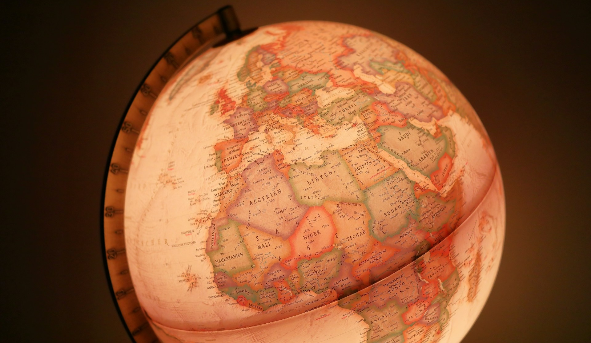
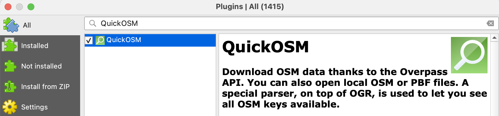
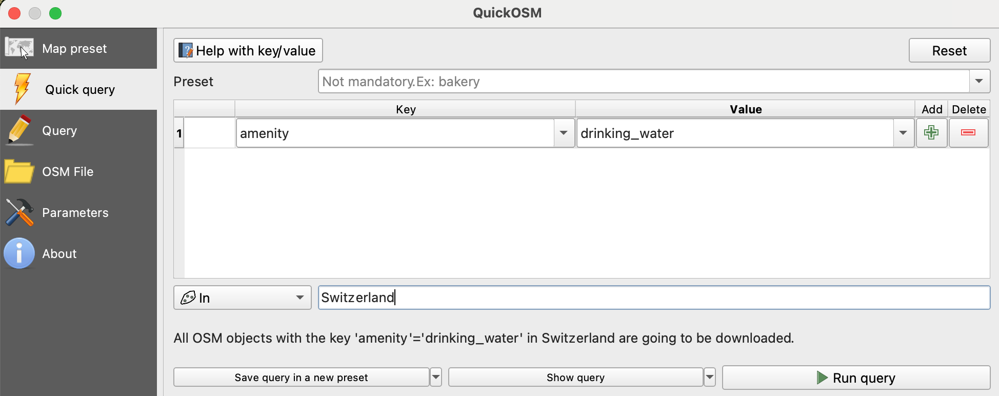
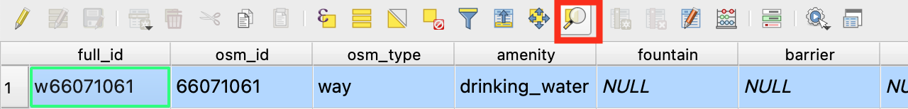

# Lab 3 - Creating Online Maps

<figure><figcaption><p>Photo by <a href="https://unsplash.com/@maksimshutov?utm_content=creditCopyText&#x26;utm_medium=referral&#x26;utm_source=unsplash">Maksim Shutov</a> on <a href="https://unsplash.com/photos/political-globe-kdLKidl6Lrc?utm_content=creditCopyText&#x26;utm_medium=referral&#x26;utm_source=unsplash">Unsplash</a></p></figcaption></figure>

## Introduction

In today’s interconnected world, geospatial data is increasingly shared and consumed through web-based platforms, allowing users to access maps and services from anywhere with an internet connection. As spatial data scientists, understanding how to assemble, preprocess, and publish geodata for online use is a critical skill. In this lab exercise, you will learn how to transform a local QGIS project into a shareable web map using QGIS Cloud, a platform that allows you to upload your data, configure services, and publish web maps with minimal effort. We will see an example of this by the end of this exercise, you will have created and shared a web map that mirrors your desktop GIS setup, equipping you with practical skills for modern geospatial workflows.

## Learning Objectives

By the end of the lab, you are able to:

* Use the QuickOSM plugin to download geospatial data.
* Merge multiple layers into a unified dataset and apply styling and symbology.
* Publish a QGIS project to QGIS Cloud and create a publicly accessible web map.
* Reflect on the challenges you encountered and how you addressed them.
* Design a unique thematic web map using open data tailored to a self-defined audience.

## Task

Welcome to the Digital Cartography Lab. You’ve just joined a civic tech nonprofit that helps communities tell spatial stories, share public resources, and promote informed decision-making. Your team is responsible for turning raw geodata into accessible, interactive maps that anyone can use, from local residents to policymakers. Your first task landed on your desk:

> _"Launch the organization’s new open mapping portal."_

Your team is preparing a series of thematic web maps that are useful, interactive and beautiful tools that empower people to explore their surroundings.

To get you started, your boss provides you with a template of a real-world example: a web map of drinking fountains in Switzerland. It’s practical, purpose-driven, and rich in cartographic design decisions. You’ll learn how to retrieve spatial data from OpenStreetMap, clean and merge geometries, style your layers, and publish your map using QGIS Cloud.

Then it’s your turn. Choose your own theme and audience. Maybe it's a map of public art in your city, bike repair stations across Zurich, or renewable energy sites across Switzerland. The tools are in your hands, your creativity drives the outcome.

### Your Mission

Create and publish a web map using QGIS Cloud. Follow the example workflow first, then adapt it to your own theme and dataset. Think about:

* Who is your map for?
* What spatial information would be useful for them?
* How can you design a map that’s informative and engaging?

### **Your Toolkit**

* **QuickOSM plugin** to fetch real-time OpenStreetMap data
* **Geometry and attribute tools** to clean and merge your data
* **QGIS Cloud** to style and publish your interactive map
* Optional extras like Swiss geodata portals or Folium/Python for advanced mapping

### Your Deliverable

Submit a short report (max. 1 page) that includes:

* [x] **Weblink**: An active link to your published web map, ensuring public accessibility.
* [x] **Topic and Rationale**: Why did you choose this theme? Who’s your target audience, and what’s the intended use?
* [x] **Data and Composition**: List your data sources, describe any preprocessing, and justify your layer selection and basemap.
* [x] **Visualization Choices**: Explain your styling, symbology, and any interactive elements (e.g., pop-ups, filters).
* [x] **Challenges and Solutions**: What didn’t work at first? How did you troubleshoot?
* [x] **Reflection and Potential Improvements**: What are you proud of? What would you refine or add with more time?

By completing this lab, you’ll gain valuable experience in web cartography—a key skill in today’s spatial data science toolkit. Time to make your map clickable, accessible, and meaningful!

## Workflow

In this lab exercise, we will create and publish a web map of drinking fountains in Switzerland. The workflow includes sourcing data from OpenStreetMap, cleaning it by filtering to our area of interest, converting geometries, and merging layers, before publishing the map using QGIS Cloud. By the end, we’ll have an interactive, shareable web map showcasing our geospatial data.

### 1. Get your data

In this example we create a web map of drinking fountains across Switzerland. This map serves as a practical tool for hikers to plan their trips by identifying water refill points and estimating their water needs. A fantastic source for open geodata is [OpenStreetMap](https://www.openstreetmap.org/#map=14/43.46803/4.54130) (OSM), a collaborative mapping platform providing rich geographic data. We will retrieve data from OSM using the [QuickOSM](https://plugins.qgis.org/plugins/QuickOSM/) plugin in QGIS.


A key limitation is that the total size of the map data to be published must not exceed **50 MB**. Be mindful of the file sizes associated with each dataset you include, and select only the data necessary to support your map’s purpose.


#### Retrieve data from OpenStreetMap

* [x] **Install the QuickOSM plugin:**
  * Go to `Plugins > Manage and Install Plugins…` in the QGIS menu.
  * Search for "QuickOSM" in the plugin manager, select it, and click "Install Plugin."

<figure><figcaption><p>Install the QuickOSM Plugin</p></figcaption></figure>

* [x] **Query data from OSM**:
  * Open QuickOSM from the `Vector` menu in QGIS.
  * Use the "Quick Query" tab to set your key-value pair for retrieving data. For example:
    * _Key_: `amenity`
    * _Value_: `drinking_water`
  * Set your geographic extent to Switzerland or a specific region (e.g., Canton Bern) by entering the area name.
  * Click "Run query" to download the data.

<figure><figcaption><p>Query data from OpenStreetMap</p></figcaption></figure>


See what other [map features](https://wiki.openstreetmap.org/wiki/Map_features) are available through OSM!


* [x] **Explore your data**:
  * The downloaded data will automatically appear in QGIS as a layer.
  * Check the feature count of the layer by right-clicking on it and selecting `Show Feature Count` to ensure the data aligns with your expectations.
  * If needed, adjust the layer styling `View > Panels > Layer Styling` to improve visibility

Now we have the foundational data for drinking fountains, ready for further refinement.

#### Retrieve data from other sources

In addition to OpenStreetMap, there are several other geospatial resources that provide a wealth of information for applications ranging from global remote sensing to local environmental analysis. These platforms provide access to different datasets across space, time and scale. Feel free to browse them for inspiration or to find the data you need.

**1. Global and Thematic Data Resources**

These platforms provide access to datasets covering a wide range of themes, from environmental, to remote sensing and socio-economic data.

* _Global Open Data Platforms:_
  * [OpenStreetMap](https://www.openstreetmap.org/#map=14/43.46984/4.54268) (OSM): Community-driven geodata accessible via [QuickOSM](https://plugins.qgis.org/plugins/QuickOSM/) in [QGIS](https://qgis.org/)
  * [Overture Maps](https://explore.overturemaps.org/#16/47.396737/8.549279): Map data initiative offering datasets for [buildings, transportation, and places](https://docs.overturemaps.org/)
  * [Natural Earth Data](https://www.naturalearthdata.com/): Free raster and vector map data for cartography
  * [World Resource Institute](https://datasets.wri.org/): Thousands of open [resources](https://www.wri.org/resources) on climate, forest, oceans and more
  * [Geoboundaries](https://www.geoboundaries.org/): Free administrative boundary data
  * [Kaggle Geospatial Datasets](https://www.kaggle.com/datasets?tags=13206-Geospatial+Analysis): Community-driven datasets for geospatial analysis
  * [Google Dataset Search](https://datasetsearch.research.google.com/): Search engine for datasets
  * [Various open data sources](https://30daymapchallenge.com/#data) and tools from the 30-days-mapping challenge
* _Earth Observation (EO) Platforms:_
  * [Copernicus Browser](https://browser.dataspace.copernicus.eu/): Visualizes satellite data from the Copernicus Programme
  * [Google Earth Engine Data Catalog](https://developers.google.com/earth-engine/datasets): Offers global datasets for geospatial analysis
  * Platforms: [CREODIAS](https://creodias.eu/), [Copernicus Data Space Ecosystem](https://dataspace.copernicus.eu/), [WEkEO](https://www.wekeo.eu/), [CODE-DE](https://code-de.org/), [EO-Lab](https://eo-lab.org/), [openeo](https://openeo.org/)

**2. International Open Geodata Portals**

* European Union: [EU Data Portal](https://data.europa.eu/data/datasets), [INSPIRE](https://inspire-geoportal.ec.europa.eu/srv/eng/catalog.search#/home), [Eurostat](https://ec.europa.eu/eurostat)
* Germany: [govdata.de](https://www.govdata.de), [geoportal.de](https://www.geoportal.de/)
* Austria: [data.gv.at](https://www.data.gv.at)
* UK: [Geoportal](https://geoportal.statistics.gov.uk/), [Ordnance Survey](https://www.ordnancesurvey.co.uk/products), [data.gov.uk](https://www.data.gov.uk/)
* USA: [data.gov](https://data.gov)

**3. Swiss Geodata Resources**

Switzerland offers a wealth of open geodata tailored for various administrative and environmental purposes.

* _National Resources:_
  * [geoharvester](https://geoharvester.ch/): A search engine and data portal for Swiss Geoservices (WMS, WFS, WFTS).
  * [SWISSGEO](https://www.geoinformation.ch/fr/swissgeo-geoplatform): The Swiss Geospatial Platform (currently in the build up)
  * [geo.admin.ch](https://www.geo.admin.ch/en): The federal geoportal
  * [map.geo.admin.ch](https://map.geo.admin.ch/): Map viewer of the federal geoportal
  * [data.geo.admin.ch](https://data.geo.admin.ch/browser/#/?.language=en): Data Catalog of the Swiss Federal Spatial Data
  * [geodienste.ch:](https://geodienste.ch/) the intercantonal portal for geodata and geodata services
  * [swisstopo](https://www.swisstopo.admin.ch/de/geodaten-und-applikationen): Free geodata, maps, and geoservices
  * [Geocat.ch](https://www.geocat.ch/) datahub: Metadata catalog for Swiss geodata&#x20;
  * [EnviDat](https://www.envidat.ch/): Environmental data repository
* _Cantonal and Municipal Portals:_
  * Cantonal data portals: [Zurich](https://geo.zh.ch/data), [Bern](https://be-geo.ch/de/shop), [Aargau ](https://www.ag.ch/de/verwaltung/dfr/geoportal)
  * Municipal data portals: [St. Gallen](https://www.stadt.sg.ch/home/raum-umwelt/geoportal.html), [Zurich ](https://data.stadt-zuerich.ch/)
* _Specialized Links:_
  * [Swiss Open Government Data](https://github.com/rnckp/awesome-ogd-switzerland): Comprehensive Swiss OGD resources&#x20;

This structured approach will help you efficiently locate, evaluate, and use open geodata for various projects.

### 2. Clean your data

Now that we have downloaded the drinking fountains dataset from OpenStreetMap, the next step is to clean and prepare it for display and further use.&#x20;


**Question**: Our downloaded dataset contains points and polygons. Why do we have different representations for drinking fountains?&#x20;

To better understand our dataset, we can open the attribute table by navigating to `Layer > Open Attribute Table` . Here, we can select individual features and zoom in on the map for a closer look. We probably also want to add a basemap[^1] for spatial context.


<figure><figcaption><p>Zoom map to the selected row</p></figcaption></figure>

#### Standardize your data

To standardize the data, we need to convert all features into a uniform geometry type before we can merge them. Since drinking fountains are best represented as points, we will transform any polygons in the dataset into points by extracting their **centroids**.&#x20;

1. Navigate to `Vector > Geometry Tools > Centroids`&#x20;
2. Choose the polygon layer as the Input Layer.&#x20;
3. You can work with the temporary layer (no input needed here)
4. Click _Run_ to generate a new point layer containing the centroids of all polygons.

Navigate to `Vector > Geometry Tools > Centroids` and choose the polygon layer as the Input Layer. We can work with the temporary layer and click _Run_ to generate a new point layer containing the centroids of all polygons.

Once the polygon centroids are created, we will **merge** them with the existing point data to have a single, unified dataset of drinking fountain locations. To do this:

1. Go to `Vector > Data Management Tools > Merge Vector Layers`.
2. Select the original point layer and the new centroid layer as inputs.
3. Define the Swiss coordinate reference system as a new projection: epsg:2056
4. Ensure the output is saved as a new point layer (e.g. water\_fountains\_CH.gpkg).
5. Click Run to create the merged dataset.


Verify that the polygon data is included in the new merged dataset.


#### Filter your data

To clean our dataset, we may want to remove empty or unnecessary attribute columns. QGIS provides a simple way to do this using the Attribute Table. Follow these steps:

1. Select the Layer and `Open Attribute Table` (Mac: `🌐+F6`, Win:`Ctrl+F6`).
2. Click on Toggle Editing Mode (, pencil icon).
3. Click Delete Field (, column icon with a red x).
4. Select the empty columns to remove (all columns except the first five - this may take a while).
5. Click OK, then Save Edits, and disable editing mode.

Now our dataset is clean and contains only meaningful attributes

#### Style your layer

When many point locations overlap, the map can look cluttered. To make your data clearer and more readable at different zoom level, you can use **Point Clustering** and **Rule-based Labeling** in QGIS.

**Point clustering:**

1. Select your point layer.
2. Open `Layer Styling → Symbology → Point Cluster`  (see image below).
3. Check _Point Cluster_ to group nearby points into clusters showing the number of points per cluster.
4. Adjust the _Distance_ parameter to change how tightly points are aggregated.
5. (Optional) Edit the Cluster Symbol to fit your map design and purpose.

<figure><figcaption></figcaption></figure>

**Rule-based Labeling:**

1. Go to Layer `Styling → Labels` and select Rule-based Labeling (see image below).
2. Click the plus icon () to add a new rule.
3. Choose the field to label (from your attribute table).
4. Set appropriate _Scale Ranges_ to control when labels appear.
5. Increase _Text Size_ (e.g. 16 pt instead of the default 10 pt) for better legibility.

<figure><figcaption></figcaption></figure>


**Tip:** You can further refine your map appearance by adjusting _symbol and text sizes_ for both points and clusters to maintain balance across zoom levels.


#### Mouse-over pop-ups

To make your pop-ups more informative and visually appealing, you can add an _HTML Map Tip_. This allows you to display multiple attributes (like name, type, description, image, and links) in a structured way when hovering over a feature.

1. Go to `Layer Properties → Display → HTML Map Tip`.
2. Enable _HTML Map Tip_ and paste the code below into the text box.
3. Adjust fields as needed to match your layer’s attribute names.
4. Click _Apply_ and hover over a feature on the map to preview your result.

Example HTML Code:

```html
<table style="font-size:16px;">
  <tr><td colspan="2"><b>[% "name" %]</b></td></tr>
  <tr><td><b>Type:</b></td><td>[% "amenity" %]</td></tr>
  <tr><td><b>Artist:</b></td><td>[% "artist_name" %]</td></tr>
  <tr><td><b>Material:</b></td><td>[% "material" %]</td></tr>
  <tr><td><b>Description:</b></td><td>[% "description" %]</td></tr>
  <tr><td><b>Wheelchair access:</b></td><td>[% "wheelchair" %]</td></tr>
  <tr><td><b>Operator:</b></td><td>[% "operator" %]</td></tr>
  <tr><td><b>Wikidata:</b></td><td><a href="https://www.wikidata.org/wiki/[% "wikidata" %]" target="_blank">[% "wikidata" %]</a></td></tr>
</table>
```

### 3. Publish your data

We are almost there. These are the remaining steps to publish our data and maps online with the QGIS Cloud web GIS service:

#### **Install the QGIS Cloud plugin**

1. Go to `Plugins > Manage and Install Plugins…` in the QGIS menu.
2. Search for "QGIS Cloud" in the plugin manager, select it, and click "Install Plugin"

<figure><figcaption><p>Install the QGIS Cloud Plugin</p></figcaption></figure>

#### **Sign up to the QGIS Cloud**

1. [https://qgiscloud.com/account/sign\_up](https://qgiscloud.com/account/sign_up)
2. Save username and password in your password manager

#### **Log in to QGIS Cloud plugin**

1. Open the QGIS Cloud panel
   * We can find it in our panels or in the taskbar (). Otherwise we can use the "Help" menu
2. &#x20;Login for your QGIS Cloud account
   * `QGIS Cloud > Account`&#x20;
   * "Login" and provide your username and password

<figure><figcaption><p>Log in to the API server</p></figcaption></figure>

#### **Publish your map**

1. Save your QGIS project as a .ggz file.
2. In the "Maps" menu you can select a suitable background layer basemap `QGIS Cloud > Maps > Add background layer` . You can also add external [basemap layers](https://hendrik-wulf.gitbook.io/sds-110-fundamentals-of-spatial-data/lab-1-visualizing-spatial-data#id-1.-basemaps) to your project, but this might slowdown the [WebMap experience](https://blog.sourcepole.ch/2024/05/02/qgiscloud-map-slow/).
3. The "Upload Data" menu allows you to select your _database_, _refresh_ all layers and _upload_ your data to the database. `QGIS Cloud > Upload data` .
4. From the "Maps" menu you can publish your map `QGIS Cloud > Maps > Publish Map` .
5. Follow the "Webmap" link in the "Maps" menu and check if your map meets your expectations.
   * If it does, you can make your map publicly available in the "Map Settings" `QGIS Cloud > Maps > Map Settings` .
   * If it does not, make the necessary adjustments before making your map publicly available.
6. [Here is the weblink](https://qgiscloud.com/hendrik_wulf/CH_drinking_water_v3/?l=drinking_water_switzerland_epsg2056_cleaned_v1%20copy%2Cdrinking_water_switzerland_epsg2056_cleaned_v1%2CPositron%2COpenStreetMap!%2CLK10%20\(grau\)!\&t=CH_drinking_water_v3\&e=968589%2C6016903%2C984591%2C6025338) for the webmap example of this workflow.

#### **Share your map**

1. Now that your data is publicly available, you can copy the Webmap link from `QGIS Cloud > Maps` and share it with interested people using the browser.
2. You can also use the WMS link and integrate the data into most GIS software as a standardized Web Map Service (WMS) that provides digital map images over the Internet.
   * In QGIS this is done in the Browser panel `View > Panels > Browser` .
   * Right click on the WMS/WMTS section () to create a "New Connection"
   * Give it a suitable name, paste the QGIS cloud Public WMS url, and inspect your new WMS layer(s).

<figure><figcaption><p>Drinking fountain locations around Zurich. </p></figcaption></figure>

### Optional: The extra mile

If you enjoyed working with QGIS Cloud, you will probably enjoy this advanced lab on web mapping as well. In this optional lab, you'll use Python and Folium to create an interactive web map directly in Google Colab. You'll add custom basemaps, markers, and spatial features, and finally export and publish your map online via GitHub Pages... all without leaving your browser.&#x20;

If you want to give it a try, your journey begins [here](https://colab.research.google.com/github/HendrikWulf/SDS110_labs/blob/main/Lab_3_Folium_Web_Mapping.ipynb).\
Completing this optional section can earn you up to 1 bonus point.

## Resources

Quick OSM

* [QuickOSM documentation](https://docs.3liz.org/QuickOSM/user-guide/end-user/)
* [QuickOSM plugin](https://plugins.qgis.org/plugins/QuickOSM/)

QGIS Cloud

* [QGIS Cloud website](https://qgiscloud.com/)
* [QGIS Cloud quickstart](https://qgiscloud.com/en/pages/quickstart)

## References

[^1]: link with section X
