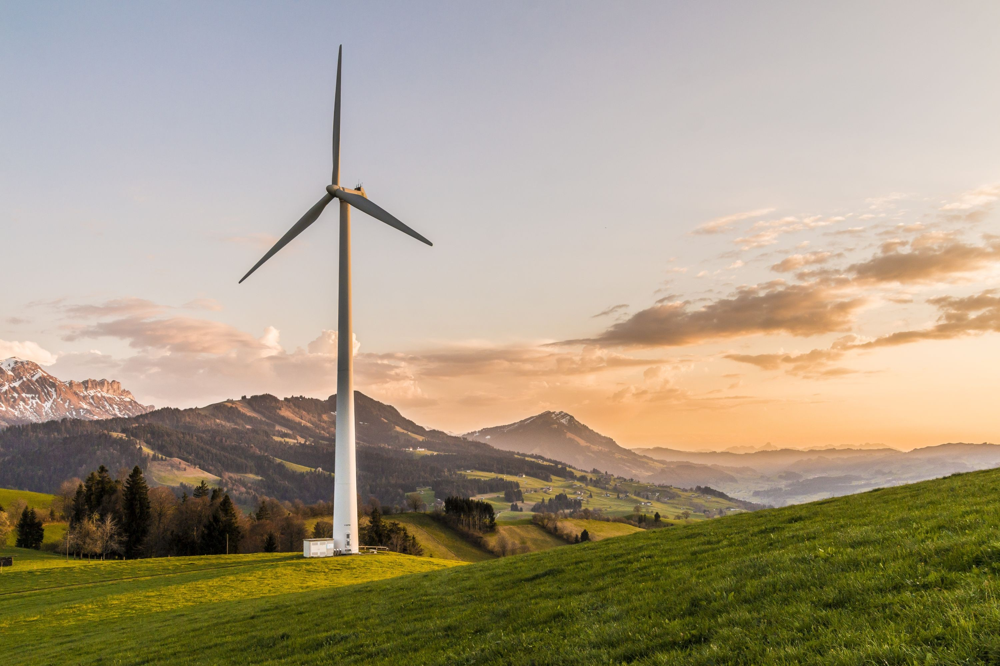

# Lab 6 - Exploring Renewable Energy

<figure><figcaption><p>Wind turbine in Entlebuch, Lucerne © <a href="https://suisse-eole.ch/de/windenergie/informationsmaterial/bilder/">Suisse Eole</a></p></figcaption></figure>

## Introduction

Switzerland plans to phase out its [nuclear power ](https://en.wikipedia.org/wiki/Nuclear_power_in_Switzerland)capacity by 2044 as part of its _Energy Strategy 2050_. Yet, as of April 2024, nuclear energy still supplies a significant share (29%, or 19.14 TWh annually)  of the country's electricity. Replacing this base-load capacity poses a major challenge, particularly during the winter months and at night when solar energy is limited. This is where _wind energy_ comes into focus: while not a stand-alone solution, it has the potential to fill critical supply gaps and contribute to a more resilient, renewable energy mix.

However, deciding where to install wind turbines isn’t straightforward. Many factors influence site suitability: Is there enough wind? Can turbines be accessed for construction and maintenance? Will they disturb protected landscapes or wildlife? Are they visible from wilderness areas prized for their natural beauty?

In this lab, you will take over the final stage of a wind energy planning project by drawing on the results of a suitability analysis for Switzerland. Based on [a study](https://suisse-eole.ch/de/news/bfe-windpotenzial/) commissioned by the Swiss Federal Office of Energy in 2022, this analysis incorporates technical, ecological, social, and economic constraints to identify areas with sustainable wind energy potential. Your task is to build on this groundwork by selecting a specific canton, identifying suitable land patches, and proposing realistic turbine locations using spatial reasoning, wind data, and spacing rules. Through this applied scenario, you will experience the challenges and decisions involved in turning spatial suitability into actionable siting plans.

## Learning Objectives

By the end of the lab, you are able to:

* Identify areas suitable for wind energy development based on multiple real-world constraints.
* Delineate and evaluate turbine siting options within a selected Swiss canton.
* Apply spacing rules and wind speed data to propose realistic turbine placements.
* Estimate the potential annual energy production of proposed turbine sites.
* Communicate your siting proposal effectively using maps and spatial evidence.

## Task

It’s mid-fall, and your engineering office is running on reduced capacity. The team has been working hard on a canton-level wind energy suitability analysis, but your colleague, who was leading the project, just dropped out with a serious case of the flu. She's out for at least two weeks.

To make matters worse, your boss is off the grid somewhere between gelato stops in Italy, and all you receive is a short text message:

> _"Can you take over and finish the wind turbine location map? We need a canton-specific proposal with concrete turbine locations. Deadline is in two weeks. Thanks!"_

Luckily, your colleague left behind a detailed project record. All spatial constraints (technical, ecological, economic, and societal) have already been combined into a single national vector layer of sustainable wind energy potential. Now it’s up to you to apply this to a specific canton and identify where turbines could realistically be placed.

### **Your Mission**

Based on the combined constraint layer from _Step 7_, complete the following:

1. _Select one canton_ in Switzerland as your study area (e.g. Vaud, Jura, or another of your choice).
2. _Clip the national suitability layer_ to the selected canton boundary.
3. **Identify suitable land patches**
4. **Propose turbine placements** within the canton:
   * Use point spacing rules (e.g. **≥500 m** between turbines)
   * Prioritize patches with **higher wind speeds**
5. **Estimate potential energy output**:
   * Use the sampled **wind speed raster** and an example turbine model (assume given capacity curve or power rating)
   * Calculate approximate **annual energy production** for your selected sites

### Your Toolkit

_Data_ from your colleague:

* _sustainable\_wind\_potential.gpkg_ – final output from Step 7 (polygon layer)
* _swissBOUNDARIES3D.gpkg_ – administrative boundaries of Swiss cantons
* _wind\_speed\_150m.tif_ – raster dataset with average wind speeds at 150 m height

_Advice_ from your colleague at [step 7.5](lab-6-exploring-renewable-energy.md#id-7.5-next-steps).

### Your Deliverable

Submit a short report (max 2 pages) including:

* [x] A map layout showing your placed turbine markers.
* [x] Your selected canton and its suitability area.
* [x] Method for selecting turbine sites, placement conflicts noted.
* [x] Number of turbines placed and total annual energy production.
* [x] Assumptions, challenges and limitations you faced.

## Workflow

### 1. Defining the Wind Energy Potential

Before diving into the data and tools, take a moment to consider **what** you are trying to find out and **why**. This step helps you frame your analysis and guides the decisions you'll make later on.

Wind energy development involves multiple, sometimes competing, interests: wind resource availability, access to infrastructure, landscape protection, and social acceptance. In this lab, you’ll conduct a **spatial suitability analysis** that balances these factors.

This diagram below illustrates the conceptual framework used to assess wind energy potential in Switzerland. It moves from **theoretical possibilities** to **practical, sustainable suitability** by progressively applying real-world constraints.

<div align="center" data-full-width="false"><figure><figcaption><p>The sustainable wind energy potential, <br>considering technical, ecological, economic, and societal constraints<br>[figure inspired by <a href="https://www.newsd.admin.ch/newsd/message/attachments/72771.pdf">Meteotest</a>]</p></figcaption></figure></div>

#### **Theoretical Potential**

This is the **broadest possible estimate** of where wind turbines _could_ be installed if there were **no** technical, environmental, social, or legal **limitations**.&#x20;

#### **Technical Potential**

Technical potential applies **physical and logistical constraints** to the theoretical space. It considers whether it's even **feasible to install and operate** wind turbines in a given location. Constraints include:

* Exclusion of water bodies, glaciers, unstable ground (e.g., debris fields, swamps)
* Exclusion of steep slopes >20%
* Lack of road access for construction/maintenance&#x20;
* Exclusion zones near civil and military air traffic (e.g., flight paths, radar interference zones)

This step filters the landscape to where wind turbines **can be built and operated**.

#### Societal **Potential (Visual Impact)**

Societal potential refers to **societal acceptance**, especially where visual intrusion in wilderness or pristine landscapes may cause resistance. This is assessed by:

* **Viewshed analysis** (from wind turbines into surrounding terrain)
* Mapping **wilderness areas** (e.g., areas with minimal human presence)
* Identifying zones where turbines would be highly visible and possibly opposed

This constraint filters out areas where turbines would likely face **public or political opposition** due to landscape impact.

#### **Ecological Potential (Protected Areas)**

Ecological potential is the part of the landscape where turbine development is **compatible with conservation goals**. This involves removing:

* Core nature reserves (e.g., national parks, BLN areas, moorlands)
* Buffer zones around sensitive habitats
* Landscapes protected by federal inventories (ISOS, UNESCO sites)

These exclusions help avoid **irreversible impacts on biodiversity and cultural landscapes**.

#### **Economic Potential (Wind Resources)**

Even if a location is technically and ecologically suitable, it must also have **enough wind** to be economically viable. In this lab and the national study, economic potential is based on:

* **Average wind speed** at turbine height (e.g., 100–150 m)
* **Estimated productivity** per square meter of rotor area

Only locations that exceed these thresholds are considered **economically attractive** for turbine investment.

#### **Sustainable Potential**

This is the **intersection** of all constraints:

* Technically feasible
* Ecologically responsible
* Economically viable
* Socially acceptable

Only the area where all these factors align is considered **sustainable wind energy potential**. These are the places where Switzerland can realistically and responsibly expand its wind energy infrastructure.

### **2. Load and Explore Key Layers**

To keep the lab manageable, all datasets have already been assembled for you. However, all data sources are documented (see Table 2.3 below), so you can trace their origin and replicate the preparation steps, if desired. Before diving into analysis, it's essential to understand the data you’ll be working with. Each dataset you load carries assumptions, limitations, and spatial meaning. In this step, you’ll gather the required input layers, learn where they come from, and explore their contents to prepare for analysis.

**Goal:** Set up your QGIS project with all core data layers and understand the purpose and origin of each dataset.

#### **2.1 Project Setup**

* Open **QGIS**
* Save your project  (e.g.`lab-6_suitability_analysis.qgz` ) inside your working directory&#x20;

#### **2.2 Inspect Datasets**

You can download all used data layers from the following shortcut link:\
[Download Lab 6 data](https://drive.google.com/drive/folders/1hCGEBLJs9cKCYOfoCr4_NX_ypHimXQpX?usp=sharing)

#### **2.3 Overview of Datasets**

<table><thead><tr><th width="275.74993896484375">Dataset Name / Size</th><th width="93.35003662109375">Directory</th><th>Source / Preprocessing</th></tr></thead><tbody><tr><td>wind_turbines.gpkg<br>(~0.2 MB)</td><td>/step_2/</td><td>[<a href="https://map.geo.admin.ch/#/map?lang=en&#x26;center=2660000,1190000&#x26;z=1&#x26;topic=ech&#x26;layers=ch.swisstopo.zeitreihen@year=1864,f;ch.bfs.gebaeude_wohnungs_register,f;ch.bav.haltestellen-oev,f;ch.swisstopo.swisstlm3d-wanderwege,f;ch.vbs.schiessanzeigen,f;ch.astra.wanderland-sperrungen_umleitungen,f;ch.bfe.windenergieanlagen&#x26;bgLayer=ch.swisstopo.pixelkarte-farbe">map.geo.admin.ch</a> → "wind energy plants" → cogwheel → <a href="https://data.geo.admin.ch/browser/index.html#/collections/ch.bfe.windenergieanlagen/items/windenergieanlagen?.language=en">download link</a>]<br>Turbine layer only; includes various attributes</td></tr><tr><td>swissBOUNDARIES3D_1_5_LV95_LN02.gpkg<br>(~73 MB)</td><td>/step_2/</td><td>Downloaded from <a href="https://www.swisstopo.admin.ch/en/landscape-model-swissboundaries3d">swisstopo</a> – all administrative units and national boundaries of Switzerland</td></tr><tr><td>TLM_rivers.gpkg<br>(~464 MB)</td><td>/step_3/</td><td>Based on <a href="https://www.swisstopo.admin.ch/en/landscape-model-swisstlm3d">SwissTLM3D</a> (~10GB)<br>Processing detailed in step <a href="lab-6-exploring-renewable-energy.md">3.1</a></td></tr><tr><td>TLM_lakes.gpkg<br>(~36 MB)</td><td>/step_3/</td><td>Based on <a href="https://www.swisstopo.admin.ch/en/landscape-model-swisstlm3d">SwissTLM3D</a> (~10GB)<br>Processing detailed in step <a href="lab-6-exploring-renewable-energy.md">3.1</a></td></tr><tr><td>SGI_2016_glaciers.gpkg<br>(~7 MB)</td><td>/step_3/</td><td>Downloaded from <a href="https://www.glamos.ch/downloads#inventories/B36-26">GLAMOS</a> - Swiss Glacier Inventory 2016<br>Processing detailed in step <a href="lab-6-exploring-renewable-energy.md">3.1</a></td></tr><tr><td>DHM25_slope_mask_vector.gpkg<br>(~285 MB)</td><td>/step_3/</td><td>Based on <a href="https://www.swisstopo.admin.ch/de/hoehenmodell-dhm25#download">DHM25</a> – DEM 25 m<br>reprojected to epsg2056 in Float32 as geotif<br>Terrain slope processing detailed in step <a href="lab-6-exploring-renewable-energy.md#id-3.2-terrain-slopes">3.2</a></td></tr><tr><td>roads_inaccessible.gpkg<br>(~3 MB)</td><td>/step_3/</td><td>Based on <a href="https://www.swisstopo.admin.ch/en/landscape-model-swisstlm3d">SwissTLM3D</a> (~10GB)<br>Filtered to relevant road types only <br>Processing detailed in step <a href="lab-6-exploring-renewable-energy.md#id-3.3-road-access">3.3</a></td></tr><tr><td>air_traffic_safety_zones.gpkg<br>(~123 MB)</td><td>/step_3/</td><td>[<a href="https://map.geo.admin.ch/#/map?lang=en&#x26;center=2660000,1190000&#x26;z=1&#x26;topic=ech&#x26;layers=ch.swisstopo.zeitreihen@year=1864,f;ch.bfs.gebaeude_wohnungs_register,f;ch.bav.haltestellen-oev,f;ch.swisstopo.swisstlm3d-wanderwege,f;ch.vbs.schiessanzeigen,f;ch.astra.wanderland-sperrungen_umleitungen,f;ch.bfe.windenergieanlagen&#x26;bgLayer=ch.swisstopo.pixelkarte-farbe">map.geo.admin.ch</a> → "safety zone plan" → cogwheel → <a href="https://data.geo.admin.ch/browser/index.html#/collections/ch.bazl.sicherheitszonenplan/items/sicherheitszonenplan">download link</a>]<br>Processing detailed in step <a href="lab-6-exploring-renewable-energy.md#id-3.4-air-traffic-safety-zone">3.4</a></td></tr><tr><td>wilderness_mask.gpkg<br>(~10 MB)</td><td>/step_4/</td><td>Based on <a href="https://mountainwilderness.ch/themen/wildnis-in-der-schweiz/">Mountain Wilderness</a>, 100 m <br>reprojected to epsg2056 in uint8 as geotif<br>Processing detailed in step <a href="lab-6-exploring-renewable-energy.md#id-4.1-mask-high-wilderness-areas">4.1</a></td></tr><tr><td>settlements_buffer_500m.gpkg<br>(~14 MB)</td><td>/step_4/</td><td>[<a href="https://map.geo.admin.ch/#/map?lang=en&#x26;center=2660000,1190000&#x26;z=1&#x26;topic=ech&#x26;layers=ch.swisstopo.zeitreihen@year=1864,f;ch.bfs.gebaeude_wohnungs_register,f;ch.bav.haltestellen-oev,f;ch.swisstopo.swisstlm3d-wanderwege,f;ch.vbs.schiessanzeigen,f;ch.astra.wanderland-sperrungen_umleitungen,f;ch.bfe.windenergieanlagen&#x26;bgLayer=ch.swisstopo.pixelkarte-farbe">map.geo.admin.ch</a> → "settlements" → cogwheel → <a href="https://data.geo.admin.ch/browser/index.html#/collections/ch.bfe.windenergieanlagen/items/windenergieanlagen?.language=en">download link</a>]<br>Processing detailed in step <a href="lab-6-exploring-renewable-energy.md#id-4.2-exclude-urban-areas">4.2</a></td></tr><tr><td>protected_areas_combined.gpkg<br>(~56 MB)</td><td>/step_5/</td><td>Merged from federal inventories: BLN, parks, etc.<br>Processing detailed in <a href="lab-6-exploring-renewable-energy.md#id-5.-ecological-constraint">step 5</a></td></tr><tr><td>wind_speed_lt4_5_vector.gpkg<br>(~3 MB)</td><td>/step_6/</td><td>Based on <a href="https://globalwindatlas.info/">Global Wind Atlas (GWA)</a> - Wind speed at 150 m above ground (hub height level)<br>Processing detailed in <a href="lab-6-exploring-renewable-energy.md#id-6.-economic-constraint">step 6</a></td></tr><tr><td>sustainable_wind_potential.gpkg<br>(~156 MB)</td><td>/step_7/</td><td>Layer combining all previous steps.<br>Processing detailed in <a href="lab-6-exploring-renewable-energy.md">step 7</a></td></tr></tbody></table>

#### **2.4 Explore the Layers**

* Load at least the layers from step 2 & step 7 into QGIS
* Use:
  * **Identify Tool** to inspect values and attributes
  * **Symbology Panel** to adjust color ramps and transparency
  * **Attribute Table** to explore classifications and coverage

#### **2.5 Style the Wind Turbine Layer**

To better visualize turbine heights:

1. Add the `wind_turbines.gpkg` dataset to QGIS:
2. Explore the attribute table:
   * Focus on `hubHeight`, `rotorDiameter`, and other descriptive fields
3. Style the turbines symbology:
   * Set the rendering style to _Graduated_
   * Set the `Value` field to _hubHeight_
   * Click the symbol to open the editor:
     * In the "_Marker_" window expand and select the submenu "_Simple Marker_"
     * Change `Symbol layer type` to _SVG Marker_
     * At the bottom in the panel (scroll all the way down) click the three dots () and load the provided `wind-turbine.svg` file (see downloaded course materials /step\_2/ directory)
     * Further up again, set the Anchor point to "Bottom"
   * Go back () to the Graduated symbology panel:
     * Set `Method` to _Size_
     * Click `Classify`
     * Adjust the `Size` range until the turbines are clearly visible on the map
4. Filter out the inactive, dismantled turbines&#x20;
5. Add a suitable [basemap](lab-1-visualizing-spatial-data.md#id-1.-basemaps) and save your project

<figure><figcaption><p>Wind turbine locations in the Jura</p></figcaption></figure>

By the end of this step, you will have created your project, learned to style spatial data effectively, and gained an overview of all relevant datasets. You're now ready to move on with [step 7.5](lab-6-exploring-renewable-energy.md#id-7.5-next-steps) or explore each constraint in more detail.


**Important:** You do _not_ need to complete steps 3 to 7.4 yourself. These steps are included here for transparency and to allow reproducibility. However, it’s recommended that you _read through them_ to understand how the data was prepared. Once you're familiar with the process, you can continue directly with [step 7.5](lab-6-exploring-renewable-energy.md#id-7.5-next-steps).


### **3. Technical Constraint**

<details>

<summary>Technical Constraint</summary>

Wind energy development is not only a question of wind availability, it also depends on whether a location is physically suitable for construction and long-term maintenance. In this step, we assess the **technical feasibility** of wind turbine placement by identifying areas with unstable ground, steep terrain, poor accessibility, or aviation restrictions. These conditions can prevent or complicate turbine installation and must be excluded from potential siting zones.


**Goal:** Define areas that are **technically suitable** for wind turbine deployment by excluding: (1) Unstable ground (rivers, lakes, glaciers), (2) Steep terrain (slopes > 20°), (3) Areas without road access (beyond 1 km of suitable roads) and (4) Air traffic safety zones.


#### **3.1 Unstable Ground**

**3.1.1. Rivers**

The rivers dataset was derived from the full _SwissTLM3D_ _dataset_ by first extracting the river subset (`TLM_gewaesser_fliesgewaesser.gpkg`) and filtering for features where `objektart is 'Fliessgewaesser'`. The resulting line features were then buffered by 10 m and dissolved to approximate the area physically occupied by rivers. The final dataset was exported as `TLM_rivers_10m-buffer.gpkg`.

**3.1.2. Lakes**

The lakes dataset was derived from the full _SwissTLM3D dataset_ by extracting the subset `TLM_bb_bodenbedeckung.gpkg` and filtering for features where `objektart is 'Stehende Gewaesser'`. The selected lake features were then exported as `TLM_lakes.gpkg`.

**3.1.3. Glaciers**

The glacier dataset is based on the Swiss Glacier Inventory 2016, available from the [GLAMOS website](https://www.glamos.ch/downloads#inventories/B36-26). The original shapefile (`SGI_2016_glaciers.shp`) was converted to GeoPackage format for improved compatibility and saved as `SGI_2016_glaciers.gpkg`.

#### **3.2 Terrain Slopes**

Construction and maintenance of wind turbines require relatively flat terrain. Steep slopes are considered technically unsuitable. In this step, you’ll use the _digital terrain model_ ([DHM25](https://www.swisstopo.admin.ch/de/hoehenmodell-dhm25#DHM25---Download)) to identify and exclude areas with slopes greater than 20°.

* **Reproject the DEM to EPSG:2056**
  * Go to **Raster → Projections → Warp (Reproject)**
  * Input layer: `DHM25.tif`
  * Target CRS: **EPSG:2056 – CH1903+ / LV95**
  * Resampling method: **Bilinear**&#x20;
  * Save as: `DHM25_epsg2056.tif`&#x20;
* **Calculate slope from the DEM**
  * Go to **Processing Toolbox** → _GDAL_ → **Raster analysis** → _Slope_
  * Input layer: `DHM25_epsg2056.tif`&#x20;
  * Save the result as: `slope.tif`
* **Create a binary mask for slopes ≤ 20°**
  * Go to **Raster → Raster Calculator**
  * Expression: `"slope@1" >= 20`
  * This will assign value **1** to areas with steep slopes ≥ 20° and **0** to flatter terrain
  * Save output as: `slope_mask.tif`&#x20;
*   **Convert slope mask to vector**

    * Go to **Raster → Conversion → Polygonize (Raster to Vector)**
    * Input layer: `slope_mask.tif`
    * Field name: `DN`
    * Save as: `slope_mask_vector.gpkg`
    * Open the attribute table and **remove features where `DN = 0`** (steep areas)
      * Use **Select by Expression**: `"DN" = 0`
      * Delete selected features or export only `"DN" = 1` features to a new layer

    You now have a vector layer showing all **terrain areas with slope ≤ 20°**, ready to be used in your technical constraint overlay.

#### **3.3 Road Access**

The road dataset was derived from the full _SwissTLM3D dataset_ by extracting the road subset (`swissTLM3D_TLM_STRASSE.shp`) and filtering for technically accessible road types with a width of 2 m or more. The resulting line features were then _buffered by 1 km_ and _dissolved_ to represent areas that are considered technically accessible by road.

To identify areas that are inaccessible for wind turbine installation due to road constraints, a spatial difference operation was performed between the national boundary (`switzerland_outline`) and the 1 km road buffer (`roads_buffer_1km.gpkg`). This was done using `Vector → Geoprocessing Tools → Difference`, with the output saved as `road_inaccessible.gpkg`. The resulting layer highlights all regions in Switzerland located more than 1 km away from accessible roads.

#### **3.4 Air Traffic Safety Zone**

To access the data on air traffic safety zones, go to [https://map.geo.admin.ch](https://map.geo.admin.ch), search for the _safety zone plan_, and click the cogwheel () and info () buttons next to the layer. Scroll down in the layer description until you find the **"Link for download"** section to download the dataset.

The downloaded file (`sicherheitszonenplan_2056.gpkg`) was processed by **dissolving overlapping features** (Vector → Geoprocessing Tools → Dissolve) to create a unified layer representing all restricted zones. The resulting dataset was saved as `air_traffic_safety_zone.gpkg`.

By the end of this section, you will have assembled a set of **technical exclusion layers**, each representing a condition that disqualifies a location for wind turbine construction. These layers can be combined into a single technical constraint mask (Vector → Data Management Tools → Merge Vector Layers), forming a critical input for identifying sustainable wind energy potential.

</details>

### **4. S**ocietal **Constraint**

<details>

<summary>Societal Constraint</summary>

Even when wind conditions and terrain are suitable, the **acceptance of wind turbines by local communities** and the **impact on sensitive landscapes** must be considered. Social constraints often stem from visual impact, proximity to settlements, and broader landscape values. In this step, we evaluate areas where wind turbines are likely to trigger social resistance or degrade the perceived naturalness of the environment. These constraints help ensure that wind energy development is not only technically and economically feasible but also socially responsible.

#### **4.1 Mask High-Wilderness Areas**

[Wilderness areas](https://mountainwilderness.ch/themen/wildnis-in-der-schweiz/) are valued for their remoteness and natural character, making them especially sensitive to visual disturbances. In this subsection, we will create a binary mask of high-wilderness areas by thresholding the wilderness raster and converting it into vector format. This provides a first-order constraint.

* Load and examine the wilderness dataset `wilderness_swiss.tif`.
* Go to `Raster → Raster Calculator`
  * Expression: `"wilderness_swiss@1" > 16`&#x20;
  * Save as: `wilderness_mask.tif`&#x20;
* **Convert the raster mask to vector**
  * Go to **Raster → Conversion → Polygonize (Raster to Vector)**
  * Input layer: `wilderness_mask.tif`
  * Field name: keep as `DN`
  * Save as: `wilderness_mask_vector.gpkg`
* **Remove polygons with DN = 0**
  * Open the attribute table of `wilderness_mask_vector.gpkg`
  * Use **Select by Expression:** "DN" = 0
  * Toggle editing mode
  * Delete selected features
  * Toggle editing mode, again, to save your edits.

This layer masks out areas with high wilderness value.

#### **4.2 Exclude Urban Areas**&#x20;

Proximity to populated areas is another key societal constraint. Wind turbines located too close to residential zones often face strong opposition due to concerns about noise, shadow flicker, or visual intrusion. In this step, you'll identify and mask areas **within 500 m of larger settlements**, using urban footprint data and basic spatial analysis.

After calculating settlement areas, you’ll buffer the larger ones, rasterize the result, and invert it to create a mask highlighting zones that should be excluded due to social sensitivity. This mask will later be combined with other constraint layers.

1. **Load the settlement layer**
   * Add the vector layer: `settlements.gpkg` (polygon layer with urban footprints)
2. **Calculate area of each polygon**
   * Open the **Attribute Table**
   * Click **Field Calculator** ()
     * Create a new field: `area_m2`
     * Field type: _Integer_
     * Expression: $area
       * _This calculates area in square meters based on the layer's CRS)_
3. **Filter for large settlements**
   * Use **Select by Expression**: "area\_m2" > 20000
   * This selects settlements larger than 20,000 m² (2 ha)
   * Export the selected features as a new layer: `settlements_filtered.gpkg`
4. **Buffer the settlements by 500 m**
   * Go to **Vector → Geoprocessing Tools → Buffer**
   * Input: `settlements_filtered.gpkg`
   * Distance: `500`
   * Dissolve result: `check`
   * Save as: `settlements_buffer_500m.gpkg`&#x20;
     * This task takes a few minutes.
5. **Convert the buffer to a raster mask**
   * Go to **Raster → Conversion → Rasterize (Vector to Raster)**
   * Input layer: `settlements_buffer_500m.gpkg`
   * A fixed value to burn: 1 (urban buffer)&#x20;
   * output raster size units: Georeferenced units
   * Width / Height: 25
   * Output extent: Calculate from layer → DHM25
   * Output data type: Int16
   * Save as: `urban_mask.tif`&#x20;
6. **Invert the Urban Buffer Mask**
   * Go to **Raster → Raster Calculator**
   * Enter the expression to invert the values: `"urban_mask@1" != 1`&#x20;
   * Save the output as: `urban_mask_inverted.tif`

The resulting `urban_mask_inverted.tif` marks areas **outside settlements** as unsuitable for wind turbines. This social constraint will be used in the final overlay of all constraint layers.

By the end of this step, you’ll have a raster identifying where wind turbines are visible from sensitive wilderness areas. This output represents a **social constraint** to be included in your final suitability model.

</details>

### **5. Ecological Constraint**

<details>

<summary>Ecological Constraint</summary>

Wind energy development must avoid conflicts with [protected natural areas](https://www.bafu.admin.ch/bafu/de/home/themen/biodiversitaet/oekologische-infrastruktur/biotope-von-nationaler-bedeutung.html). In this step, you’ll identify **ecologically sensitive zones** where wind turbines should not be placed. These include national parks, landscape protection areas, waterbird habitats, and other legally protected sites. Collecting and combining this data is a tedious process. This is why we provide the final dataset "**protected\_areas\_combined.gpkg**" upfront. But you should be in a position to reproduce this dataset based on the following steps.&#x20;

#### **5.1 Load Protected Area Layers**

To access the data, go to [https://map.geo.admin.ch](https://map.geo.admin.ch), search for the relevant dataset, and click the cogwheel () and info () buttons next to the layer. Then scroll down in the layer description until you find the _**"**&#x4C;ink for downloa&#x64;**"**_ section. These links are given below for each dataset.

* `bundesinventare-auen_2056.shp` ([floodplains](https://data.geo.admin.ch/browser/index.html#/collections/ch.bafu.bundesinventare-auen/items/bundesinventare-auen))
* `bundesinventare-flachmoore_2056.shp` ([fens](https://data.geo.admin.ch/browser/index.html#/collections/ch.bafu.bundesinventare-flachmoore/items/bundesinventare-flachmoore))
* `bundesinventare-hochmoore_2056.shp` ([raised bogs](https://data.geo.admin.ch/browser/index.html#/collections/ch.bafu.bundesinventare-hochmoore/items/bundesinventare-hochmoore?.language=en))
* `bundesinventare-moorlandschaften_2056.shp` ([mire landscapes](https://data.geo.admin.ch/browser/index.html#/collections/ch.bafu.bundesinventare-moorlandschaften/items/bundesinventare-moorlandschaften))
* `bundesinventare-trockenwiesen_trockenweiden_2056.shp` ([dry grasslands](https://data.geo.admin.ch/browser/index.html#/collections/ch.bafu.bundesinventare-trockenwiesen_trockenweiden/items/bundesinventare-trockenwiesen_trockenweiden?.language=en))
* `bundesinventare-vogelreservate_2056.shp` ([bird reserves](https://data.geo.admin.ch/browser/index.html#/collections/ch.bafu.bundesinventare-vogelreservate/items/bundesinventare-vogelreservate?.language=en))
* `naturerlebnis_und_nationalpark.gpkg` ([swiss national park](https://data.geo.admin.ch/ch.bafu.schutzgebiete-schweizerischer_nationalpark/data.zip))
* `unesco-weltnaturerbe_2056.shp` ([world heritage](https://data.geo.admin.ch/browser/index.html#/collections/ch.bafu.unesco-weltnaturerbe/items/unesco-weltnaturerbe?.language=en))
* `schutzgebiete-paerke_nationaler_bedeutung.shp` ([swiss parks](https://data.geo.admin.ch/browser/index.html#/collections/ch.bafu.schutzgebiete-paerke_nationaler_bedeutung/items/schutzgebiete-paerke_nationaler_bedeutung))

Load the vector datasets into QGIS using drag & drop.

#### **5.2 Clean and Prepare Layers**

Make the layers mergeable by simplifying attributes:

1. **Remove long or problematic fields** (e.g., names with special characters):
   * Open the dataset `bundesinventare-vogelreservate_2056.shp`
   * Right-click layer → _Open Attribute Table_ → _Toggle Editing_ → _Delete Field_
   * remove the `name` field&#x20;
2. **Filter by relevant categories** (for `parks.gpkg`):
   * Open the dataset `schutzgebiete-paerke_nationaler_bedeutung.shp`
   * Open the attribute table
   * Filter by `"type" = 'Nationalpark' OR "type" = 'Naturerlebnispark'`
   * Export the selection

#### **5.3 Merge Layers into a Single Protected Areas Layer**

To create a single mask of all protected zones:

1. Go to **Vector → Data Management Tools → Merge Vector Layers**
2. Select all cleaned and filtered protected area layers
3. Save the merged output as: `protected_areas_combined.gpkg`

This layer now represents all **ecological exclusion zones**.


**Check**: To check whether current wind turbine locations overlap with protected areas, you can simply _browse the map_ in QGIS by overlaying the `wind_turbines` and `protected_merged` layers. Zoom in to visually inspect for intersections.

For a more robust and reproducible check, use _Select by Location_: set `wind_turbines` as the target layer and `protected_merged` as the source layer with the **"**_intersect_**"** predicate. Save the selected turbines as `turbines_in_protected.gpkg` to document any spatial conflicts.


By the end of this step, you will have a comprehensive spatial layer showing ecologically sensitive areas where wind turbine development should be avoided. This constraint will form one part of your final suitability analysis.

</details>

### **6. Economic Constraint**

<details>

<summary>Economic Constraint</summary>

Wind turbines must be placed where there’s enough wind to generate energy efficiently and make the investment worthwhile. In this step, you will assess whether existing or potential turbine sites meet a **minimum wind productivity threshold**.


**Goal:** Use wind speed data to evaluate economic potential and create a mask of locations that meet minimum wind resource requirements.


#### **6.1 Load the Wind Speed Raster**

1. Add the raster file `wind_speed_150m.tif` to your QGIS project.
   * This raster comes from the [**Global Wind Atlas**](https://globalwindatlas.info/) and represents average wind speed in m/s at 150 m above ground, matching modern turbine hub heights.
2. Right-click the layer → _Properties_ → _Symbology_
   * Apply a color ramp (e.g., batlow, Viridis or davos) to better visualize areas with high and low wind.

<figure><figcaption><p>Average wind speed across Switzerland (Soft Light blending mode with the DHM25 hillshade image)</p></figcaption></figure>

#### **6.2 Create a Layer for Wind Suitability**

To use this in your final suitability map:

1. Go to **Raster Calculator**
2.  Expression:

    ```
    "wind_speed_150m@1" < 4.5
    ```
3. Save as: `wind_suitability_mask.tif`

This binary raster highlights **only areas with wind speeds below 4.5 m/s**, considered economically unsuitable.

* **Convert the raster mask to vector**
  * Go to **Raster → Conversion → Polygonize (Raster to Vector)**
  * Input layer: `wind_suitability_mask.tif`
  * Field name: keep as `DN`
  * Save as: `wind_suitability_mask_vector.gpkg`
* **Remove polygons with DN = 0**
  * Open the attribute table of `wind_suitability_mask_vector.gpkg`
  * Use **Select by Expression:** "DN" = 0
  * Toggle editing mode
  * Delete selected features
  * Toggle editing mode, again, to save your edits.

By the end of this step, you will have identified where the wind is strong enough to support economically viable wind energy production. This constraint completes the last major input for your final suitability map.

</details>

### **7. Combine Constraints**

Now that you’ve identified social, technical, ecological, and economic constraints, it’s time to **bring everything together**. In this step, you’ll combine the constraints into a single vector layer that shows areas where all criteria are met. This layer represents your **sustainable wind energy potential**.

#### **7.1 Merge Constraint Layers**

First, merge all individual constraint layers (vector polygons representing exclusions). To merge them into a single exclusion layer:

* Go to **Vector → Data Management Tools → Merge Vector Layers**
* Select all relevant constraint layers
* Save as: `merged_constraints.gpkg`

#### **7.2 Subtract Exclusions from National Boundary**

Now calculate the difference between the Switzerland boundary and the combined exclusion areas:

* Go to **Vector → Geoprocessing Tools → Difference**
* **Input layer**: `switzerland_outline.gpkg`
* **Overlay layer**: `merged_constraints.gpkg`
* Save output as: `suitable_areas_raw.gpkg`

This produces a new layer that includes only the areas that meet _all_ constraints.&#x20;

#### **7.3 Convert Multipart to Singleparts**

The result of the difference operation consists of a single feature containing many disjoint polygons (a multipart geometry). To analyze and filter these areas individually you first need to split them into separate singlepart features.

* Go to **Vector → Geometry Tools → Multipart to Singleparts**
* Input layer: `suitable_areas_raw.gpkg`
* Output file: `suitable_areas_singleparts.gpkg`

This creates a new layer where each polygon is treated as an individual feature, allowing for accurate area calculations and filtering in the next step.

#### **7.4 Filter by Area**

Small leftover fragments may not be suitable for real wind turbine installations. Remove very small polygons (e.g. <1 hectare) by calculating area and filtering:

1. Open the **Attribute Table** of `suitable_areas_singleparts.gpkg`
2. Open **Field Calculator**
   * New field: `area_m2`
   * Expression: `$area`&#x20;
3. Use **Select by Expression**: `"area_m2" > 20000`
4. Export the selection as: `suitable_wind_potential.gpkg`

#### **7.5 Next Steps**

This is the last message from your colleague, who handed the project over to you.

> "The flu has claimed me. I’m officially out. Before I vanish into a pile of tissues, here are a few notes on what I would've tackled next. Good luck, brave wind warrior, it's all yours now!"

You’ve inherited a fully prepared national dataset of sustainable wind energy potential. Your job is to translate this into a canton-specific proposal, complete with selected turbine locations and a rough estimate of how much energy they could produce.

**Load and Prepare Canton Data**

* Load the [`swissBOUNDARIES3D.gpkg`](https://drive.google.com/drive/folders/1e41HqprHHfD1RqV5PZ9aiHu28U0JAD_o?usp=sharing) layer and select a suitable canton of your choice and export it as a separate geopackage.
* Clip [`sustainable_wind_potential.gpkg`](https://drive.google.com/drive/folders/1vZFbScOrrE2Sc0zG9CYlmJMRomISEMlD?usp=sharing) to your selected canton (`Vector → Geoprocessing Tools → Clip`)

**Place Turbine Points**

* Use **Vector → Research Tools → Random Points Inside Polygons**
  * Input layer: `suitable_canton.gpkg`
  * Advances option (): Skip Features with Invalid Geometries
  * Point count: Estimate max number of points based on your largest area
  * Set _minimum distance_ between points to 500 m
* Look in the Processing Toolbox for a distance tool to enforce the 500 m minimum distance between neighboring polygons
* Refine points using the Vertext tool ()
  * compare locations with [SwissImage](lab-1-visualizing-spatial-data.md#wms-wmts-layers) aerial imagery or a a satellite [basemap](lab-1-visualizing-spatial-data.md#xyz-tile-layers) or
  * optimize locations based on the wind speed map
* Sample average wind speed at your point location
  * use the [Point Sampling Tool](lab-5-modelling-spatial-data.md#sample-dem-elevations) or `Processing Toolbox → Sample Raster Values`

**Estimate Annual Energy Production**

* _Turbine model_ (assumed):
  * Rated power: 2.3 MW
* Capacity factor estimation:

$$
CF = \min\left( \left( \frac{\text{Average Wind Speed}}{12 \text{ m/s}} \right)^3, 0.6 \right)
$$

* Annual energy production:

$$
\text{E}_{\text{annual}} = \text{Rated Power} × CF × 8760 \text{ hours}
$$

**Create Your Map Layout**

* Go to `Project → New Print Layout`
* Add your map frame and adjust the _extent and scale_ to fit the selected canton
* Draw from your experience in [Lab 1](lab-1-visualizing-spatial-data.md).


**Tip:** Keep the layout clean and legible. Your map should clearly communicate your site selection logic and the spatial context for turbine placement. This final map is your visual summary and the main decision-support product your boss will see. Make it count!


### Optional: The Extra Mile

Like transmission poles, communication towers, and skyscrapers, wind turbines can significantly alter the visual character of a landscape. In this step, you’ll assess the **visual impact** of existing or planned wind turbines on **surrounding areas** using a **viewshed analysis**. The goal is to identify locations where wind turbines are visible from high-value natural areas, which could lead to public resistance and lower social acceptance.


**Goal:** Determine where wind turbines are visible from wilderness areas and create a raster showing visual conflicts.


#### **O.1 Calculate Visual Parameters**

Following the [guidelines](https://www.bafu.admin.ch/dam/bafu/de/dokumente/uvp/externe-studien-berichte/leitfaden-zur-erstellung-von-sichtbarkeitsanalysen.pdf.download.pdf/Leitfaden_Sichtbarkeit_v6-1.pdf) of the Meteotest AG for Viewshed Analysis, we'll first have to calculate the perceived height as the specific shape of a wind turbine should be taken into account. Since the rotor blades become thinner towards the outside, the outer tips of a wind turbine are barely visible from a distance. Use the following equation and the available attributes in `wind_turbines.gpkg` to calculate the effectively perceived height _H_<sub>eff</sub> and the visual impact radius W<sub>r</sub> . For your newly placed stations you can select a suitable turbine model or use average values.

Open the Attribute Table and add two new fields using the `Field Calculator` ():

* **Effective height (H**<sub>**eff**</sub>**)**

$$
H_{\text{eff}} = NH + 0.25 \cdot RD
$$

_H_<sub>eff</sub>​: effective turbine height in meters\
&#xNAN;_&#x4E;H_: hub height in meters\
&#xNAN;_&#x52;D_: rotor diameter in meters

* In the Field Calculator:
  * Define the `Output field name` : effectiveHeight
  * The `Output field type` : Integer (32 bit)
  * Enter the Expression: `hubHeight + 0.25 * diameter`&#x20;
* **Radius of influence (`Wr`)**

_W_<sub>r</sub>​: effective radius of influence (in meters)\
&#xNAN;_&#x68;_: total height of the turbine (hub height + rotor radius) in meters

* In the Field Calculator:
  * Define the `Output field name` : influenceRadius
  * The `Output field type`: Decimal number (real)
  * Enter the Expression: `1 / (9 * 10 ^ (-5) + 0.011 * 0.952 ^ (hubHeight + diameter/2))`&#x20;

These fields estimate the parts of turbines that are actually visible and how far their visual impact reaches. With these new attributes, we can create so called viewpoints by going to `Processing Toolbox > Visibility analysis > Create viewpoints.`

#### **O.2 Create Viewpoints**

With these new attributes, we can create so called _viewpoints_. Viewpoints represent the observer locations from which visibility is calculated in a viewshed analysis. In this lab, each viewpoint corresponds to the top of a wind turbine at its specific location and height. These points define where the visibility analysis begins, i.e., from where in the landscape the turbines could potentially be seen. They incorporate turbine height attributes to model how turbines appear from different distances and terrains.

* Install the Plugin "Visibility Analysis"
* Load the DEM `DHM25_epsg2056.tif`
* Go to **Processing Toolbox** → _Visibility analysis_ → **Create viewpoints**
  * Observer location(s): `wind_turbines`
  * Digital Elevation Model: `DHM25_epsg2056.tif`
  * Field value for analysis radius: `Wr` or _influenceRadius_
  * Field value for target height, meters: `Heff` or _effectiveHeight_
  * Leave all other settings as default
  * Save as `viewpoints.gpkg`

This step prepares the turbine locations for visibility modeling.

#### **O.3 Perform Viewshed Analysis**

The _viewshed analysis_ determines which areas in the landscape are visible from specific observation points, in this case, the wind turbine locations. It uses elevation data (DEM) to model line-of-sight visibility, highlighting zones where turbines can be seen from the ground.

* Go to **Processing Toolbox** → _Visibility analysis_ → **Viewshed**
  * Observer location(s): `viewpoints.gpkg`
  * Digital elevation model: `DHM25_epsg2056.tif`
  * Leave all other settings as default
  * Save the output raster as `viewshed.tif`

This raster shows which areas are **visible from at least one turbine** (value = 1), and which are not (value = 0).&#x20;


**Reflection:** How can we interpret this result?\
The viewshed raster shows how many wind turbines are visible from each location, with values ranging from 0 to 17 depending on the number of observer points used. While this provides a useful overview of visual exposure, it has key limitations: it is based on a digital terrain model (DTM) and does not account for trees or buildings that may block visibility, meaning forested areas may falsely appear exposed. It also treats all visibility equally, regardless of whether a turbine is located in an industrial or natural area, and does not consider how distance and atmospheric conditions affects visual impact. As such, the result should be interpreted as a simplified approximation of visibility.


<figure><figcaption><p>Viewshed analysis of the wind turbines. Brighter colors indicate more visible trubines.</p></figcaption></figure>

#### **O.4 Identify Visual Conflict Zones**

To find high-wilderness areas where turbines are visible:

1. Go to **Raster Calculator**
2. Expression: `"viewshed@1" * "wilderness_mask@1"`
3. Save as: `viewshed_conflict.tif`

The result shows locations where **visual impact overlaps with wilderness**, a key social constraint.

<figure><figcaption><p>Visibility of wind turbines in wilderness areas of the Valais</p></figcaption></figure>


**Reflection**:

How much of the wilderness area is affected by turbine visibility?

Would you consider adding a buffer zone around these wilderness areas? Why or why not?


## Resources

#### **Wind Energy Potential and Suitability**

* [Global Wind Atlas](https://globalwindatlas.info) – High-resolution global wind speed data at multiple hub heights.
* [Swiss Wind Energy Monitoring (Suisse Éole)](https://www.suisse-eole.ch/) – Swiss-specific resources and documentation on wind energy planning.
* [Meteotest Wind Energy Study](https://www.newsd.admin.ch/newsd/message/attachments/72771.pdf) – Study on the potential of wind energy in Switzerland.

#### **Geospatial Datasets**

* [map.geo.admin.ch](https://map.geo.admin.ch) – Official Swiss geoportal to access geospatial datasets&#x20;
* [OpenTopography – EU DTM 30m](https://opentopography.org/) – Download digital terrain models&#x20;
* [swisstopo Open Government Data](https://www.swisstopo.admin.ch/en/free-geodata-ogd) – Source for SwissTLM3D, DHM25, administrative units, & more.
* [GLAMOS – Swiss Glacier Inventory](https://www.glamos.ch/) – Glacier outlines used to mask unstable terrain.

#### **QGIS Plugins**

* [Visibility Analysis Plugin](https://plugins.qgis.org/plugins/ViewshedAnalysis/) – Used for viewshed calculations from wind turbine locations.
* [Point Sampling Tool ](https://plugins.qgis.org/plugins/pointsamplingtool/)– Sample wind speed values at proposed turbine locations.

#### **Others**

* [Wind Energy Symbol](https://www.svgrepo.com/svg/18720/windmill) - Website for SVG Symbols&#x20;

## References

ESRI (2021) _ArcGIS Desktop, Applied Analysis_, [Minimizing the environmental impact of wind farm installation](https://desktop.arcgis.com/en/analytics/case-studies/minimizing-the-environmental-impact-of-windfarm-installation.htm). (Accessed: 14 July 2025).
