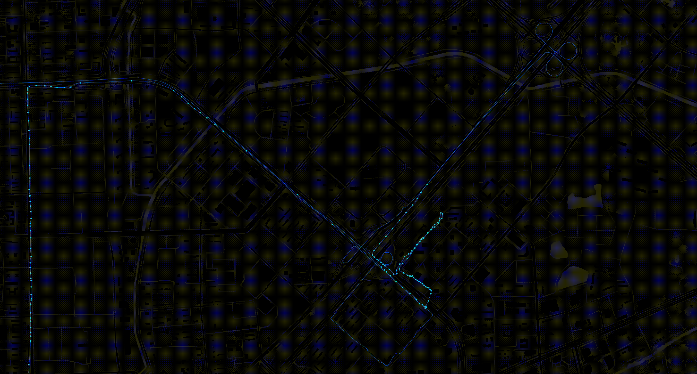
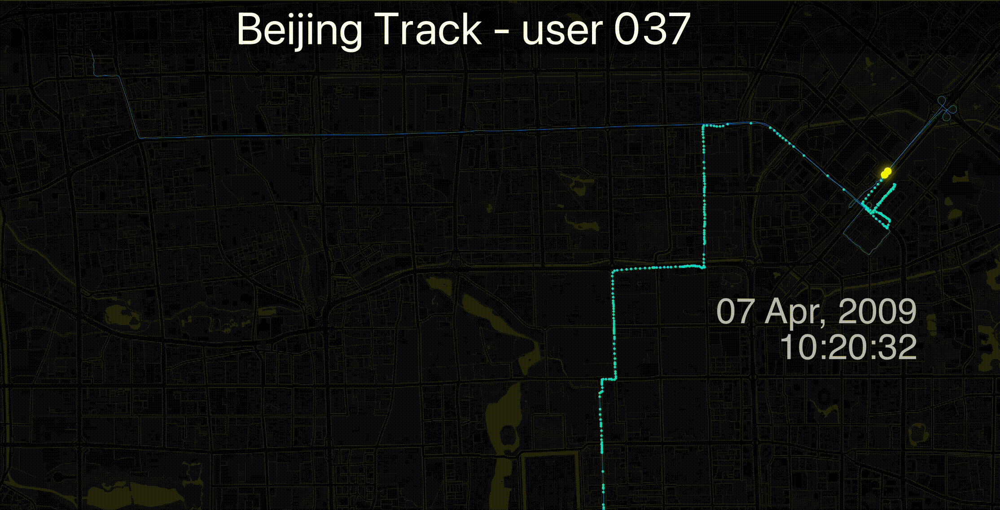

# Lab 6 - Working with Sensitive Data

<figure><figcaption><p>Photo by <a href="https://unsplash.com/@teckhonc?utm_content=creditCopyText&#x26;utm_medium=referral&#x26;utm_source=unsplash">T.H. Chia</a> on <a href="https://unsplash.com/photos/selective-focus-photography-of-push-pin-in-map-tVZMk-cidEc?utm_content=creditCopyText&#x26;utm_medium=referral&#x26;utm_source=unsplash">Unsplash</a></p></figcaption></figure>

## Introduction

Every time someone shares their location, whether through a smartphone app, fitness tracker, or GPS-enabled photo, they leave behind a digital footprint. These traces can seem harmless at first: a list of coordinates, a line on a map. But when analyzed carefully, they begin to reveal much more: routines, habits, workplaces, home addresses, and even moments of vulnerability.

In **Lab 6**, you will work with real GPS tracks from the Geolife dataset, recorded by individuals over multiple days. Through spatial and temporal analysis, you’ll extract insights about **where people go, how they move**, and **what that might say about them**. You'll calculate speeds, detect trip purposes, classify transport modes, and create animations that visualize movement over time.

But this lab is not just about technical skills, it’s also about **ethical awareness**. As you dig into someone’s movement history, ask yourself: Could you guess where this person lives? Do their routines make them predictable? How much could you learn about them without ever knowing their name? By the end of this lab, you’ll have a deeper understanding of how powerful location data can be and why handling such data responsibly is essential in the age of digital mapping.

## Learning Objectives

By the end of the lab, you are able to:

* **Explore** GPS trajectory data using temporal and spatial tools to understand movement patterns.
* **Filter** implausible GPS data by applying quality control techniques to eliminate outliers.
* **Analyze** mobility behavior, transportation modes, and potential trip purposes.
* **Compute** personal mobility metrics to quantify regularity and spatial extent of movement.
* **Critically reflect** on the privacy implications of personal location data and how mobility traces can reveal sensitive behavioral insights.

## Task

You’ve just landed an internship with **MotionSense Analytics**, a data science consultancy that works with clients ranging from health insurers to urban planners, fitness platforms, and even intelligence services. One of your first assignments comes from a mysterious partner organization with a clear but unsettling request:

> _"We’ve received anonymized GPS data from an unknown individual. We want to know what we can learn. No names, no photos, just time-stamped coordinates. Can you reconstruct this person’s life?"_

Your job is to analyze one person’s GPS trajectory and assess how much you can uncover about their behavior, movement routines, and lifestyle. You'll use the Geolife dataset, a well-known but sensitive source of GPS data collected by volunteers between 2007 and 2011. It’s anonymized, but as you'll discover, anonymity can be fragile.

The organization doesn’t care _how_ you do it, they just want results. But as a spatial data scientist with ethical awareness, you’ll keep asking:\
**What should we do with this kind of data, even if we can analyze it?**

### Your Mission

Pick **one individual** from the [Geolife dataset](https://drive.google.com/drive/folders/1X51iSXRHNutpkA8SJPNl1SAz2RyQmDnQ?usp=sharing) (e.g. `004_116-39.gpkg`, `158_121-31.gpkg`). Use your spatial analysis skills to reconstruct and interpret their daily life based on the movement data.

Use the tools and methods you’ve practiced in this lab:

* Visualize and clean time-stamped GPS tracks
* Infer home and work locations
* Detect daily routines and patterns
* Classify modes of transportation
* Identify frequently visited or sensitive places
* Create an animated visualization of one representative track
* Derive behavioral metrics like total distance, activity radius, and mobility regularity

***

### Your Toolkit

* Geolife individual track files (e.g. `004_116-39.gpkg`)
* QGIS (vector styling, field calculator, temporal controller, heatmaps, geometry tools)
* Processing Toolbox (aggregate, extract vertices, DBSCAN, animation tools)
* Basemaps and satellite imagery for contextual interpretation
* External sources (e.g. Google Earth, OpenStreetMap) for manual POI checking

***

### Your Deliverable

Submit a **brief report** that includes:

* [x] A map showing the person’s typical daily movement pattern.
* [x] Inferred key locations (home, work) with supporting spatial evidence.
* [x] Summary of travel behavior (trip purposes, transport modes, trip frequency, distances, durations, and activity radius).
* [x] Clustering analysis of frequently visited places and patterns of regularity vs. variability.
* [x] Reflection on lifestyle inferences, privacy risks, and notable or surprising findings.

***

#### Why It Matters

This lab gives you hands-on experience in **spatial behavior analysis**, a key method in location intelligence, mobility research, and digital forensics. But it also reveals the **ethical responsibility** tied to GPS and tracking data. You’ll come away with a sharper understanding of both the **power** and the **risks** of working with sensitive spatial information.

> Remember: maps don’t just show where someone went, they tell you _who they are_.

## Workflow

In this lab, we will analyze individual human mobility patterns using GPS trajectory data from the Geolife dataset. Working with one person’s movement traces, we will explore where and when they traveled, clean and enrich the data with time-based attributes, and identify key locations such as home and work. We will calculate speed and distance between GPS points, detect and remove implausible tracks, classify transportation modes, and investigate the likely purposes of trips. Finally, we will compute mobility metrics such as total daily distance and activity radius, and reflect on how such data can reveal detailed behavioral insights, raising important questions about location privacy and data sensitivity.

### 1. Get to know your data

Before we dive into analysis, we’ll take some time to explore and understand the GPS data we’ll be working with. We'll investigate where and when this person moved and prepare the data for further analysis.

***

#### Select Your Dataset

You will work with the GPS data of **one individual** from the [Geolife dataset](https://www.kaggle.com/datasets/arashnic/microsoft-geolife-gps-trajectory-dataset).&#x20;

<figure><figcaption><p>All GPS tracks from the Geolife dataset</p></figcaption></figure>

Each user’s data has been **aggregated into a single GeoPackage file**, containing all GPS tracks for that person. The files are named with a numeric ID and the user’s **median longitude and latitude,** for example:

* `004_116-39.gpkg` → user 004, median location around 116°E / 39°N
* `158_121-31.gpkg` → user 158, median location around 121°E / 31°N

Some users have more extensive data (covering many days), while others only cover short time periods. You may choose based on file size and geographic interest, which dataset to pick. You can download your data [here](https://drive.google.com/drive/folders/1X51iSXRHNutpkA8SJPNl1SAz2RyQmDnQ?usp=sharing). For this workflow, we use user `037_116-39.gpkg` (41 MB).&#x20;

***

#### Visualize the Data Spatially

* Load the GPS point layer for your selected user.
* Add a basemap for context (e.g. CartoDB, OSM)
* Zoom out to see where the user has been.

<figure><figcaption><p>Beijing tracks of user 037</p></figcaption></figure>

***

#### Visualize the Data Temporally

Explore **when** the data was recorded.

* Open the _Attribute Table_ and inspect the `date` field (oldest and latest recording).
* Install the _Data Plotly_ plugin (see [Lab 2](lab-4-analyzing-spatial-data.md#add-non-spatial-insights-with-dataplotly) for additional information)
* Go to _View → Panels → Data Plotly_ to enable the [Data Plotly Panel](lab-4-analyzing-spatial-data.md#add-non-spatial-insights-with-dataplotly).
* Create a _Histogram_:
  * _Layer_: your GPS points layer
  * _X Field_: `date`&#x20;
  * Set _Bin Size_ to the approximate number of days covered

<figure><figcaption><p>Temporal distribution of user 037 tracks</p></figcaption></figure>

***

#### Clean the Data

* In the Attribute Table:
  * Check whether there are _empty or null values_ in the `datetime` or `time` fields.
  * You can filter with this expression: `"datetime" IS NULL`&#x20;
  * If such records exist, toggle the editing mode () and remove ()

***

#### Transform the Time to Local Time

The original `datetime` values in the dataset are recorded in GMT (UTC+0). To analyze when the user was actually active in local time (China Standard Time, UTC+8), we need to convert the timestamps accordingly.

To shift to Beijing Time (UTC+8) open the Field Calculator () in the Attribute Table.

* Create a new field named `local_datetime` (Output field type: Date & Time)
  * Use this expression to shift the time by 8 hrs: `"datetime" + make_interval(hours := 8)`
* Create a `local_time` field (type: `Text (string)`) for filtering by time of day: `substr(to_string("local_datetime"), 12, 8)`&#x20;
* Create a `local_hour` field (type: `Integer (32 bit)`) for filtering by hour of day: `hour("local_datetime")`

<figure><figcaption><p>Use <a href="lab-4-analyzing-spatial-data.md#add-non-spatial-insights-with-dataplotly">DataPlotly</a> to display hourly and weekly patterns (weekday 0 = Sunday)</p></figcaption></figure>

* Create a `weekday` field (type: `Integer (32 bit)`) for filtering by day of week: `day_of_week("local_datetime")`
* Create a `weekday_str` field (type: `Text (string)`) for filtering by day of week:&#x20;

```
CASE
  WHEN weekday = 0 THEN 'Sunday'
  WHEN weekday = 1 THEN 'Monday'
  WHEN weekday = 2 THEN 'Tuesday'
  WHEN weekday = 3 THEN 'Wednesday'
  WHEN weekday = 4 THEN 'Thursday'
  WHEN weekday = 5 THEN 'Friday'
  WHEN weekday = 6 THEN 'Saturday'
END
```

### 2. Home and work locations

In this step, you will analyze where the person in your GPS dataset likely lives and works. You’ll use time-based filtering and spatial clustering to make educated guesses about the locations of their home and workplace.

***

#### Add Basemaps

* In your Layers panel Add Groups () for _Street_ and _Satellite Basemaps_&#x20;
* Populate the Street Basemaps group with _OpenSteetMap, CartoDB Dark Matter & Positron, and Google Streets_.
  * Note that _Google Streets_ is [obfuscated](https://medium.com/@anastasia.bizyayeva/every-map-of-china-is-wrong-bc2bce145db2) in China, but it provides additional English labels over _OpenStreetMap_.
  * As an alternative, you can use the [Beijing Map](https://web.beijingmap.cn/) from Baidu, which has English labels as well.
* Populate the Satellite Basemaps group with _Google Satellite_, _ESRI Satellite_, and _Bing Aerial_.

***

#### Style with Heatmap to Visualize Clusters

* Render your GPS-tracks-layer as a [heatmap](lab-4-analyzing-spatial-data.md#id-4.-create-a-heatmap).
* Set the **color ramp** and its `Color 1` to transparent (click into the color ramp, see [Lab 5](lab-5-modelling-spatial-data.md#optional-enhancements)).
* Apply the style and observe where points are densest.
* Zoom into high-density heatmap clusters and compare locations with your basemaps.
  * Look for residential buildings, public parks or infrastructure

***

#### Explore Times of Interest

* Use the [Query Builder](lab-4-analyzing-spatial-data.md) to filter for likely work times between 09:00 and 17:00 on weekdays

<pre><code><strong>"local_time" >= '09:00:00' AND "local_time" &#x3C;= '17:00:00' AND "weekday" IN (1,2,3,4,5)
</strong></code></pre>

<figure><figcaption><p>Day-time filter</p></figcaption></figure>

* Active during night hours (before 07:00 or after 21:00) on weekdays

```
("local_time" < '07:00:00' OR "local_time" > '21:00:00') AND "weekday" IN (1,2,3,4,5)
```

<figure><figcaption><p>Night-time filter</p></figcaption></figure>

&#x20;These time-based filters help isolate different types of movement or behavior. For example:

* Morning routines (e.g. 06:00–09:00)
* Lunch breaks (e.g. 12:00–14:00)
* Evening leisure or commute (e.g. 17:00–20:00)
* Weekend patterns (e.g. `"weekday" IN (0,6)` for Sunday and Saturday)

You can experiment with different time windows and day selections to reveal spatial patterns, such as clusters that appear only on weekends or shifts in activity between day and night.


**Attention**: In this case, the person's most frequently visited nighttime location appears to lie within a park. Could they have been working night shifts as a park ranger? Perhaps they were homeless and sought shelter there? Another possibility is that the area was not a park back in 2009, when the GPS tracks were recorded. If you examine high-resolution satellite imagery from [Google Earth](https://earth.google.com/web/@39.98075824,116.25684652,65.80597917a,937.69502477d,35y,0.00000001h,19.23277228t,0r/data=ChYqEAgBEgoyMDA5LTA2LTI4GAFCAggBOgMKATBCAggASg0I____________ARAA), you’ll see that the landscape has changed significantly. In 2009, this location included several buildings, very likely the individual’s home at the time. These land cover changes may also explain seemingly impossible movements, such as walking across water. Keep in mind that this region has evolved rapidly over the past decade, and unusual behaviors, like frequently crossing railroad tracks, may simply reflect tunnel, bridges, or how the infrastructure looked at the time.


<div><figure><figcaption><p>Either the lake is frozen, or the lake was created later, or No. 037 is Jesus.</p></figcaption></figure> <figure><figcaption><p>GPS tracks follow the road in a tunnel under railway tracks.</p></figcaption></figure></div>

***

#### Explore Locations of Interest

Once you've identified dense clusters of GPS points, such as those revealed by a heatmap or visual inspection, you can manually select points from these areas to investigate further.

1. Use the Select Features tool () to highlight a group of nearby points (a spatial cluster).
2. Open the Attribute Table and click the “Move selection to top” button () to bring selected records into view.
3. Explore the common characteristics of these points:
   * What weekdays do they occur on?
   * What times of day are most frequent?

This manual inspection helps you interpret the purpose of specific locations, e.g. a cluster of points on weekday evenings could indicate a home location, while frequent midday points on weekdays might suggest a workplace or lunch spot.

***


**Try to answer the following questions:**&#x20;

* What do you think is the person’s **home location**?
* Where do they probably **work**?
* How regular are their movements?
* What changes do you observe between **weekdays and weekends**?


### 3. Speed analysis

Now that you’ve explored spatial clusters, it’s time to calculate **how fast** the person was moving. This will help you infer transportation modes and gain deeper insight into their daily behavior.

You’ll calculate:

* **Time difference** between points (in seconds)
* **Distance** between consecutive GPS points (in meters)
* **Speed** in kilometers per hour (km/h)

#### Reproject to a CRS with Meters

To calculate distance accurately, you need to use a coordinate reference system (CRS) that uses **meters**.

1. Open the **Processing Toolbox** and search for **“Reproject layer”**.
2. Set your GPS point layer as the input.
3. Set the **target CRS** to **EPSG:3857 – WGS 84 / Pseudo Mercator**.
4. Save the output as a new layer (e.g. `gps_projected`).

This reprojected layer allows you to compute distances using meters instead of degrees.

#### Add Output Fields

You’ll need three fields to store the results:

1. Open the **Attribute Table** for your reprojected layer.
2. Open the **Field Calculator** and create the following fields:
   * `time_diff_s` – Decimal (real)
   * `distance_m` – Decimal (real)
   * `speed_kmh` – Decimal (real)
3. Use `NULL` as the expression for each (they will be filled by the script).

***

#### Run the Python Script

1. Go to `Plugins → Python Console`, then click the **Show Editor** ().
2. Paste in the script provided below (in the expandable block).
3. Click **Run Script** ( button in the Editor).

<details>

<summary>Expand this <strong>Script</strong> to calculate time difference, distance, speed, and track ID</summary>

```python
# ------------------------------------------------------------
# Script: Calculate time difference, distance, speed, and track ID from GPS points
# Purpose: Processes a GPS point layer to compute:
#   - time_diff_s: time between consecutive points (seconds)
#   - distance_m:  distance between consecutive points (meters)
#   - speed_kmh:   derived speed (km/h)
#   - track_id:    segment ID that increases when time gap > 5 minutes
# Usage:
#   - The layer must have a datetime field named 'local_datetime'
#   - The layer should use a projected CRS (e.g. EPSG:3857) for accurate distances
#   - The script will create missing fields if needed
# ------------------------------------------------------------

from qgis.PyQt.QtWidgets import QProgressBar
from qgis.core import Qgis, QgsFeatureRequest, QgsField
from qgis.PyQt.QtCore import QVariant

# --- Select the active point layer ---
layer = iface.activeLayer()
layer.startEditing()

# --- Ensure output fields exist; create them if missing ---
required_fields = {
    "time_diff_s": QVariant.Double,
    "distance_m": QVariant.Double,
    "speed_kmh": QVariant.Double,
    "track_id": QVariant.Int
}

existing_field_names = [field.name() for field in layer.fields()]

for field_name, field_type in required_fields.items():
    if field_name not in existing_field_names:
        layer.dataProvider().addAttributes([QgsField(field_name, field_type)])

# Refresh field list
layer.updateFields()

# --- Get field indexes ---
idx_time = layer.fields().indexFromName("time_diff_s")
idx_dist = layer.fields().indexFromName("distance_m")
idx_speed = layer.fields().indexFromName("speed_kmh")
idx_track = layer.fields().indexFromName("track_id")

# --- Prepare dictionaries for bulk attribute updates ---
updates_time = {}
updates_dist = {}
updates_speed = {}
updates_track = {}

# --- Sort features by 'local_datetime' ---
request = QgsFeatureRequest().addOrderBy("local_datetime", ascending=True)
features = list(layer.getFeatures(request))
total = len(features)

# --- Initialize reference values ---
prev_time = None
prev_geom = None
track_id = 1  # Start first segment

# --- Create a progress bar ---
progress = QProgressBar()
progress.setMaximum(total)
iface.messageBar().pushWidget(progress, Qgis.Info)

# --- Process each feature ---
for i, f in enumerate(features):
    fid = f.id()
    curr_time = f["local_datetime"]
    curr_geom = f.geometry()

    if prev_time and prev_geom:
        # Compute time difference in seconds
        time_diff = (curr_time.toPyDateTime() - prev_time.toPyDateTime()).total_seconds()
        # Compute distance in meters (requires projected CRS!)
        dist = curr_geom.distance(prev_geom)
        # Compute speed in km/h
        speed = (dist / time_diff) * 3.6 if time_diff > 0 else None

        # Start a new track if time gap exceeds 5 minutes (300 seconds)
        if time_diff > 300:
            track_id += 1
    else:
        # For first point, set all metrics to None
        time_diff = None
        dist = None
        speed = None

    # Store attribute updates
    updates_time[fid] = {idx_time: time_diff}
    updates_dist[fid] = {idx_dist: dist}
    updates_speed[fid] = {idx_speed: speed}
    updates_track[fid] = {idx_track: track_id}

    # Update previous values
    prev_time = curr_time
    prev_geom = curr_geom

    progress.setValue(i + 1)

# --- Apply all updates in bulk ---
layer.dataProvider().changeAttributeValues(updates_time)
layer.dataProvider().changeAttributeValues(updates_dist)
layer.dataProvider().changeAttributeValues(updates_speed)
layer.dataProvider().changeAttributeValues(updates_track)

layer.commitChanges()
iface.messageBar().clearWidgets()
print("Done: Calculated time_diff_s, distance_m, speed_kmh, and assigned track_id.")

```

</details>


**Note:** The script may take some time to complete, depending on the size of your dataset.\
For reference: a file with **200,000 entries (41 MB)** took approximately **1 minute** to process.


#### Interpret the Results

Now check your **Attribute Table**:

* Are there long time gaps between some points?
* Where are the highest speeds? Do they align with long-distance travel?
* What speed ranges suggest walking, biking, or driving?

You can use **categorized symbology** on `speed_kmh` to visualize fast vs. slow segments.

***

#### Filter for Realistic Speeds

GPS data can sometimes contain errors — for example, sudden spikes in speed due to poor signal or recording gaps. To focus your analysis on **realistic human movement**, you can filter the data to include only those records where the calculated speed is between **0 and 200 km/h**.

* Open the **Attribute Table** of your layer.
* Click the **Select Features Using an Expression** (abacus icon).
* Use this expression:

```
"speed_kmh" >= 0 AND "speed_kmh" <= 200
```

* Click **Select Features**, then use the **“Filter selected features”** button if you want to work with just this subset.

#### Privacy Reflection

Even if someone only shares time-stamped GPS points, speed analysis can reveal:

* Transportation modes
* Regular routes and habits
* Changes in daily behavior

> Ask yourself: Would you be okay with an app calculating and storing this information about you?


* Method: Estimate speed between points; infer modes of transport (e.g. walk, bike, car).
* Insight: Transport preferences, average commute speed.
* Privacy takeaway: Lifestyle indicators and socioeconomic inferences.


### 4. Track analysis&#x20;

After assigning `track_id`s to individual GPS points based on time gaps, we can now analyze each **track as a movement segment**. This includes generating paths, measuring distance and duration, calculating average speed, and identifying unusual tracks (e.g. from GPS error or data glitches).

#### Generate One Path per Track

Use the **Points to Path** tool to convert GPS points into line features—one for each movement segment:

1. Open the **Processing Toolbox**
2. Search for **“Points to Path”**
3. Set:
   * **Input layer**: your point layer
   * **Order by expression**: `local_datetime` (ensures correct point sequence)
   * **Group by expression**: `track_id` (creates one path per track)
4. Run the tool → the output is a line layer where each feature is a single track


#### Calculate Track Length and Duration

Open the **Field Calculator** and compute:

**1. Track length in meters**

* Create a new field: `length_m` (type: Decimal)
*   Expression:

    ```
    $length
    ```

**Track duration in seconds**

* Assuming your layer has `begin` and `end` datetime fields for each track:
* Create a new field: `duration_s` (Decimal)
*   Expression:

    ```
    second(age("end","begin"))
    ```

**3. Average speed in km/h**

* Create a new field: `avg_speed_kmh` (Decimal)
*   Expression:

    <pre><code><strong>("length_m" / "duration_s") * 3.6
    </strong></code></pre>


### 5. Filter implausible data

Not all track segments are reliable. Some contain errors caused by GPS drift, missing timestamps, or gaps in recording. These often result in unusually long straight lines that don’t represent real-world movement. In this step, you will identify and remove such implausible tracks, based on segment length.

#### Explode Multipart Lines

Merged GPS paths are sometimes stored as MultiLineString geometries. To analyze each individual path accurately, you need to explode these into single LineString features.

1. Open the Processing Toolbox
2. Search for “Explode lines”
3. Input: the output layer from the “Points to Path” step
4. Run the tool

You now have a layer where each feature is a single continuous LineString.

#### Calculate Segment Lengths

To detect suspiciously long segments:

1. Open the Attribute Table of the exploded line layer
2. Open the Field Calculator
3. Create a new field named seg\_length\_m (type: _Decimal number_)
4. Use the expression:

5\.  $length

This calculates the length of each segment in meters.

#### Identify and Export Long Segments

Now identify segments that are unusually long (e.g. ≥ 400 meters — typically an error in a pedestrian dataset):

1. Open Select by Expression
2. Use: "seg\_length\_m" >= 400
3. With the long segments selected, right-click the layer →\
   Export → Save Selected Features As...\
   Save them as a new file, e.g. long\_segments.gpkg

#### Extract Unique Track IDs from Long Segments

You now want to find which track\_id values are associated with those implausible segments.

1. Go to: Vector → Analysis Tools → List Unique Values
2. Input layer: long\_segments.gpkg
3. Field: track\_id
4. Click Run

Check the log panel at the bottom for the list of values. They will be separated by semicolons (;).

To use the list in QGIS expressions, convert it to comma-separated format. For example, copy the list and ask your favorite LLM to:

Replace the ; with , in this list: 515;6;7;523;...

#### Filter and Export Clean Track Paths

Now you’ll use the cleaned list of track\_id values to exclude bad tracks from your full track path dataset.

1. Open the full track\_path layer (from “Points to Path”)
2. Open Attribute Table → Select by Expression
3. Use: "track\_id" NOT IN (515,6,7,523,...)
4. Select the valid tracks and export them:
5.
   * Right-click the layer → Export → Save Selected Features As...
   * Save as: clean\_tracks\_filtered.gpkg


#### Method: Use “Select by Location” Tool

1. Go to:\
   **Processing Toolbox → Vector Selection → Select by Location**
2. Set:
   * **Input layer (features to select):** your **point layer**
   * **Intersecting features:** your **line layer**
   * **Geometric predicate:** `"intersects"`
   * Leave other settings at default
   * Click **Run**
3. QGIS will now select all points that **spatially intersect with the line layer**.

#### To Export the Filtered Points

Once the correct points are selected:

1. Right-click the point layer in the Layers panel
2. Choose **Export → Save Selected Features As...**
3. Save as a new GeoPackage or Shapefile (e.g. `filtered_points.gpkg`)


### 6. Mode of transport

Now that you’ve cleaned your GPS data and constructed continuous movement tracks, you can begin analyzing how the person likely traveled. By using **average speed** as an indicator, you’ll assign a likely **mode of transportation** to each track (or point), such as walking, biking, driving, or public transport.

This step shows how location data reveals not only where and when someone moved, but **how**.

#### Classify Transportation Mode Based on Speed

Assign a **mode label** based on the **average speed** of each track, calculated earlier as `avg_speed_kmh`.

1. Open the **Field Calculator** on your filtered track layer
2. Create a new field: `mode_guess` (type: _Text - string_)
3.  Use the following expression:

    ```
    CASE
      WHEN "avg_speed_kmh" IS NULL THEN 'Unknown'
      WHEN "avg_speed_kmh" <= 6 THEN 'Walk'
      WHEN "avg_speed_kmh" <= 15 THEN 'Bike'
      WHEN "avg_speed_kmh" <= 25 THEN 'PublicTransport'
      ELSE 'Car'
    END
    ```


These thresholds are approximations. You can adjust them to suit the data (e.g. 20–30 km/h might be e-bikes or city driving).


#### Visualize Movement Modes

Style your track layer based on `mode_guess`:

1. Right-click the layer → **Properties → Symbology**
2. Set **Categorized Style**
   * Column: `mode_guess`
   * Choose distinct colors for each mode (e.g. walking = blue, car = red)
3. Apply

This makes different travel behaviors visible at a glance.

***

#### Analyze Movement Mode Patterns

Try the following:

* Use the **“DataPlotly” panel** to count how many tracks fall into each mode
* Plot a **histogram chart** of mode frequencies
* Check:
  * Is walking mostly near residential areas?
  * Are high-speed tracks aligned with major roads?


### 7. Trip purposes

Each track in your dataset represents a continuous movement without long breaks. By analyzing **where & when** tracks begin and end you can make educated guesses about the **purpose** of each trip. Was it a commute to work in the morning? A walk to the grocery store at lunch? A return home in the evening?

In this section, you'll extract the **start and end points** of each track and use spatial and temporal context to explore what these trips might represent.

#### Extract Start and End Points of Tracks

1. Open the **Processing Toolbox**
2. Search for **“Extract specific vertices”**
3. Input: your cleaned **track line layer**
4. For **start points**:
   * Vertex index = `0`
   * Name output: `track_start_points`
5. For **end points**:
   * Vertex index = `-1`
   * Name output: `track_end_points`

Each point feature will inherit the attributes of the track it came from (e.g. `track_id`, `begin`, `end`, `avg_speed_kmh`).

#### Merge the Layers

* Go to `Processing Toolbox → Vector General → Merge Vector Layers`
* Input layers: `start_points` and `end_points`
* Output: `track_endpoints`

#### Add Spatial Context

To interpret the purpose of each trip, you need to understand what’s located at the start and end points.

Inspect Available Imagery

* Display the track\_endpoints as a heatmap
* Zoom in on frequent start/end locations
* Inspect satellite and street basemaps
* Consult [Google Earth](https://earth.google.com/web/@39.79727909,116.28799418,49.8572338a,2095.70166082d,35y,0h,0t,0r/data=ChYqEAgBEgoyMDA5LTA2LTI4GAFCAggBOgMKATBCAggASg0I____________ARAA) satellite image, if temporal changes occurred
* Streetview images in China are available via [Baidu Maps](https://map.baidu.com/) &#x20;
* Manually check for building footprints, bus stops or parks
* Select the endpoint locations and investigate patters in time and transport


**Insights**: By combining spatial and temporal information at the **start and end points of trips**, we begin to uncover patterns in a person’s daily life. Frequent departures from a residential area in the morning followed by arrivals in a commercial zone hint at a **daily commute**. Endpoints near parks, retail centers, or transit hubs can suggest **leisure activities**, **shopping trips**, or **public transport use**. Through careful inspection of heatmaps, satellite imagery, and temporal filters, even a dataset stripped of names and addresses begins to tell a deeply **personal story**. This step reveals how much of a person's routine, preferences, and behavior can be inferred — raising important questions about **location privacy and data sensitivity**.



### 8. Mobility metrics

Beyond identifying where someone goes, GPS data can reveal **how mobile** and **how predictable** their movements are. In this section, you’ll calculate metrics such as **total distance traveled**, **activity radius**, and **temporal regularity**, which are commonly used in mobility studies and human behavior modeling.

These insights are powerful for understanding daily routines—but they also show how easily a person could be **profiled** based on their location data.

#### Average Distance Traveled

You already calculated the length of each track (`length_m`). Now summarize how far this person moved on average per day.

1. Open the **Attribute Table** of your track layer
2. Create a new field: `travel_date` (type: _Date_)
3. Expression: `to_date("begin")`

This extracts just the date (no time) from the `begin` field.


Use the **"Aggregate"** tool to summarize total distance and duration per day.

1. Open **Processing Toolbox**
2. Search for **“Aggregate”**
3. Input layer: your tracks layer
4. **Group by**: `travel_date`
5. Aggregates:
   * `sum("length_m")` → call it `daily_distance_m`
   * `sum("duration_s")` → call it `daily_duration_s`
   * `count(track_id)` → call it `daily_track_count`
   * `mean(avg_speed_kmh)` → call it `daily_avg_speed_kmh`
   * `first(travel_date)` → call it `date`

Output: a new layer and attribute table with one row per day and total movement stats.


Now that you have total distance and time per day:

1. Open the new **aggregated table**
2. Use the **Field Calculator** or **Statistics Panel** to compute:
   * **Average daily distance** = mean of `daily_distance_m`
   * **Average daily travel time** = mean of `daily_duration_s` (convert to minutes/hours)
3. Create a **scatter plot** showing daily distance and track duration over time (with **Data Plotly**)



**Example**: In this example, the person recorded an average of 6.4 trips per day, covering a distance of 43.4 km and lasting 2.2 hours, at an average speed of 14.9 km/h.


<div><figure><figcaption><p>Scatter plot of average daily track length (in meter)</p></figcaption></figure> <figure><figcaption><p>Scatter plot of average daily track duration (in seconds) </p></figcaption></figure></div>


#### Activity Radius

The **activity radius** describes how far a person typically moves from a central point (often their "home base").

**Steps:**

1. Use **Mean Coordinates (Centroid)** of all GPS points:
   * Go to `Vector → Analysis Tools → Mean Coordinate(s)`
   * Input: your filtered GPS points
   * Output: `centroid layer`
2. Calculate distance from each point to that centroid:
   * Use **Field Calculator** on your GPS point layer
   * Create a field: `dist_centroid_m` (Decimal)
   * Expression: `distance($geometry, geometry(get_feature('centroid_layer', 'fid', 1)))`&#x20;
3. Use the **Statistics Panel** to calculate:
   * Mean and standard deviation of `dist_from_centriod`\
     → this gives you a sense of the **person’s activity radius**


**Example:** In this case, the person’s average distance from their activity center was 35.4 km, with a wide spread (standard deviation: 111.5 km), suggesting both routine movements and occasional long-distance travel. The median distance of 12.7 km reflects that most activities occurred closer to home.



These and other mobility metrics help answer questions like:

* Does the person mostly stay in one area or move widely?
* Do they follow a consistent daily routine?
* How often do they visit new places?

These can be used to model routines, predict next locations or **profile** individuals in ways they may not expect.

#### Privacy Takeaway

Some people’s mobility patterns are highly regular — they go to the same places at the same times. Others move more randomly or explore widely. These patterns are often invisible until you quantify them.

> 🔎 Behavioral metrics like activity radius and regularity are commonly used in commercial, marketing, and surveillance applications. They can be used to **predict behavior**, **infer lifestyle**, or even flag someone as “anomalous.”

### Optional: The Extra Mile 1

#### Animating GPS-Tracks in QGIS

So far, you’ve explored where a person went, when, how fast, and possibly why. In this step, you’ll turn one of those tracks into a **dynamic animation** that visually shows the person’s movement over time. This helps to better understand the **temporal rhythm** of a trip and creates an engaging way to communicate mobility behavior.



#### Export One Track

Choose a representative or interesting track from your cleaned `track_path` layer to animate.

* Open the **Attribute Table** of the `track_path` layer
* Use **Select by Expression** to choose a track: `track_id = 355`&#x20;
* Right-click the layer → **Export → Save Selected Features As...**\
  Save as `selected_track.gpkg`
* Use **“Select by Location”** to extract corresponding points:
  * Input: your filtered GPS point layer
  * Intersects with: `selected_track.gpkg`
  * Export the selected points as `selected_track_points.gpkg`



#### Prepare the Map for Animation

* Open a **new QGIS project**
* Add:
  * `selected_track.gpkg` (line)
  * `selected_track_points.gpkg` (points)
* Add a **basemap**:\
  `Web → QuickMapServices → CartoDB → Dark Matter [no labels]`
* Style the track:
  * Set color: Blue
  * Width: 0.2

<div align="center"><figure><figcaption></figcaption></figure></div>

* Style the point layer:
  * Set symbol size: 1
  * Fill color: light blue
  * Stroke: transparent

<figure><figcaption></figcaption></figure>

* **Filter for every Nth point** (optional, for smoother animation):
  * Change the _Symbol layer type_ from **Simple Marker** to **Geometry generator**.
  * Expression: `if(@id % 3 = 0, $geometry, NULL)`&#x20;

<figure><figcaption></figcaption></figure>



#### Add Glow Effect to Animated Points

* Duplicate the point layer (`right-click → Duplicate`)
* Move the copy to the top of the layer list
* Style:
  * Size: 3
  * Color: bright neon
  * Enable **Draw Effects** → Outer Glow:
    * Spread: 2
    * Blur radius: 2



#### Enable Time-Based Animation

Enable temporal control for both point layers:

* Right-click each layer → **Properties → Temporal**
* Set:
  * Enable: ✅ Dynamic temporal control
  * Configuration: Single Field with Date/Time
  * Field: `local_datetime` or similar
* For the glow layer, also check: ✅ _Accumulate features over time_



#### Set Up the Temporal Controller

* Open the **Temporal Controller** panel ( icon in top toolbar)
* Select the _Animated temporal navigation_ ()
  * Set to Full Range ()
  * Step: `10 seconds`
  * Adjust the Temporal Settings ( , top right) → Frame rate: `10 fps`
  * Enable Loop ()
* Click ▶️ **Play** to view the animation

<figure><figcaption></figcaption></figure>

Your animation should now show the person’s movement over time with a glowing trail that accumulates as they progress.

<figure><figcaption></figcaption></figure>





#### Add a Title and Timestamp Label

To give your animation more context, you can add a **dynamic timestamp label** and an optional title.

1\. Create a Point Layer for the Label

* Go to `Layer → Create Layer → New GeoPackage Layer`
* Save as `label.gpkg`, set geometry type to **Point**
* Add a point where you want the label to appear
  * Click the _Toggle Editing_ button () from the _Digitizing Toolbar_.&#x20;
  * Use the _Add Point Feature_ button () to place the timestamp label.
  * In the _Feature Attribute_ pop-up, click _OK_.

2\. Configure the Label

* Open the **Layer Styling Panel** for `label.gpkg`
* Switch to the **Labels** tab ()
* Select  from the drop-down menu
*   Use this expression () to format the timestamp:

    ```
    format_date( @map_start_time, 'dd MMM, yyyy| hh:mm:ss')
    ```
* Style the font, size, and alignment to your liking
* Change from Text to the **Formatting** tap ()&#x20;
  * Under **Multiple lines**, set the wrap character to `|`&#x20;
  * Set the Alignment to `Right`

3\. Hide the Marker

* In the **Symbology** tab, set symbol size to `0`



#### Enable Time Sync for the Label

To make the timestamp update during animation:

* Right-click the label layer → **Properties → Temporal**
* Enable: ✅ Dynamic temporal control
* Set Configuration: **Redraw layer only**



#### Add a Static Title

* Go to `View → Decorations → Title Label`
* Enable and enter a title (e.g. `"Beijing Track – April 2009"`)
* Set placement and font to your preference

<figure><figcaption><p>GPS track animation</p></figcaption></figure>



### Optional: The Extra Mile 2

Visualizing GPS data in [kepler.gl](https://kepler.gl/)&#x20;

Now that you’ve analyzed, filtered, and classified movement data in QGIS, it’s time to bring it to life with an interactive, web-based visualization. In this short extension, you’ll use [**Kepler.gl**](https://kepler.gl) (an open-source geospatial tool developed by Uber) for fast and beautiful visual exploration of movement patterns.



**Step 1: Prepare Your Data in QGIS**

* Load your [filtered point layer](lab-6-working-with-sensitive-data.md#to-export-the-filtered-points) (e.g. `filtered_points.gpkg`)
* Right-click the layer `→ Export → Save Features As...`
  * Format: `CSV`
  * CRS: `WGS 84 (EPSG:4326)`
  * File name: `gps_export.csv`



**Step 2: Upload to Kepler.gl**

* Go to [https://kepler.gl](https://kepler.gl)
* Click `"Get Started"`
* Drag and drop your `gps_export.csv` file into the browser window
* Kepler.gl will auto-detect columns (lat/lon, time) and suggest visualizations



**Step 3: Style and Explore**

* In the _Layers_ panel ():
  * Choose _Point_ → set color based on `speed_kmh` or `local_hour`
  * Adjust `color scale`, `radius`, or `add a heatmap layer`
* In the _Filters_ panel ():
  * Filter by `local_datetime` to explore movement over time
  * Click _Time playback_ () to explore different animations
* In the _Base map_ panel ():
  * Explore different _Map Style_ and _Map Layer_ settings
* Explore different Layer visualizations and menu options on the right



<figure><figcaption><p>Hexbin layer visualization in 3D</p></figcaption></figure>

## Resources

#### GPS Dataset

* [**Geolife GPS Trajectories (GitHub)**](https://github.com/Microsoft/Geolife) – Time-stamped GPS traces from 178 users, including daily routines, travel behavior, and personal movement histories.

#### Mobility Metrics and Analysis

* [**MIT Senseable City Lab – Urban Mobility Projects**](https://senseable.mit.edu/) – Real-world applications of movement data to study urban dynamics.
* [**Location Entropy Research**](https://www.nature.com/articles/srep01376) – Paper on predictability and randomness in individual mobility traces.
* [**Strava Global Heatmap**](https://www.strava.com/maps/global-heatmap?sport=All\&style=dark\&terrain=false\&labels=true\&poi=true\&cPhotos=true\&gColor=blue\&gOpacity=100#11/47.3697/8.5411) – Publicly shared GPS activity visualized as a global density map.

#### Ethics, Privacy & Legal Context

* [**NYT: How Phones Expose Where You Go**](https://www.nytimes.com/interactive/2019/12/19/opinion/location-tracking-cell-phone.html) – An investigative piece showing how easily individuals can be re-identified.
* [**ETH Zürich Blog**](https://ethz.ch/de/news-und-veranstaltungen/eth-news/news/2025/01/blog-was-standorte-verraten.html) – What your location data reveals—even without your name. _(in German)_
* [**EFF Guide to Location Privacy**](https://www.eff.org/issues/location-privacy) – Why GPS data matters and how it can be misused.
* [**SRF Investigative Report**](https://www.srf.ch/news/schweiz/cookie-banner-so-teilen-die-groessten-schweizer-webseiten-ihre-heiklen-daten) **-** How Swiss Websites Share Sensitive Data. _(in German)_&#x20;
* [**SRF Guide**](https://www.srf.ch/news/schweiz/anleitung-gegen-tracking-drei-einfache-schritte-um-ihre-handy-daten-zu-schuetzen) - Three Simple Steps to Protect Your Mobile Data.

#### Context & Reflection

* [**Film: Das Leben der Anderen (The Lives of Others)**](https://www.netflix.com/ch/title/70056425) – A powerful dramatization of state surveillance and the erosion of privacy.
* [**Podcast: Dark Agent**](https://www.deutschlandfunk.de/dark-avenger-100.html) – A true story about digital identity, data misuse, and surveillance. _(in German)_
* [**MapScaping Podcast**](https://mapscaping.com/an-in-depth-look-at-location-data-privacy/) – A deep dive into how location data is collected, used, and why it matters.
* [**EthicalGEO Blog**](https://ethicalgeo.org/blog/) – Thoughtful commentary on the ethical challenges of using geospatial technologies in society.

## References

Gandhi, U. (2025) Animating GPS Tracks ([video](https://www.youtube.com/watch?v=cf3FiJzqIro)), _Spatial Thoughts_. Available at: [https://courses.spatialthoughts.com/advanced-qgis.html#animating-gps-tracks](https://courses.spatialthoughts.com/advanced-qgis.html#animating-gps-tracks) (Accessed: 14 July 2025).
